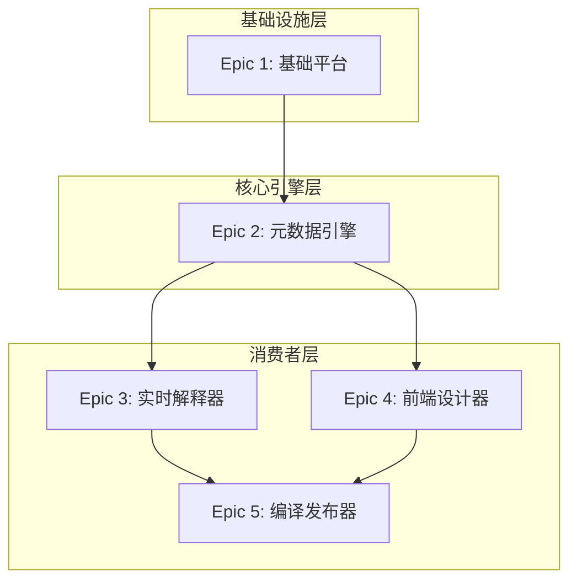

# fastbuild Product Requirements Document (PRD)

**Author:** bobo
**Date:** 2025-10-08
**Project Level:** Level 2 (Small Complete System)
**Project Type:** Web Application
**Target Scale:** 5-15 stories, 1-2 epics

---

## Description, Context and Goals

fastbuild 是一个开源无代码开发平台，基于 Next.js 14 全栈单体架构构建，实现从数据库到用户界面的端到端类型安全。平台采用统一的 Vercel 部署策略，简化开发和运维复杂性，帮助企业和IT专业人员快速构建内部业务应用程序和自动化工作流程。

### Deployment Intent

MVP for early users - 面向早期用户的MVP版本，支持开源社区采用和快速反馈收集

### Context

在数字化转型加速的背景下，企业对应用程序的需求日益增长，但传统软件开发模式周期长、成本高且面临技术人员短缺挑战。现有无代码解决方案多为专有产品，存在供应商锁定风险，定制化和扩展性不足。随着无代码市场快速增长和企业对开源、可控解决方案需求增加，现在是推出基于现代化、高性能技术栈的开源平台的最佳时机。

### Goals

1. **短期目标 (1年内)**：实现10,000次开源版本下载，获得100个活跃早期用户，建立500+贡献者的社区
2. **用户成功目标**：用户能在30分钟内构建并部署一个应用，开发效率提升至少50%
3. **商业目标**：在第二年实现$50,000的月度经常性收入（MRR）
4. **技术目标**：实现端到端类型安全，构建可扩展的模块化单体架构

## Requirements

### Functional Requirements

**FR001:** 平台必须提供一个可视化的、支持拖拽操作的界面构建器，用于创建Web应用的用户界面

**FR002:** 界面构建器必须包含一个实时预览功能，该功能会随着用户的设计更改而即时更新

**FR003:** 用户必须能够通过一个专门的属性面板来选择组件并编辑其属性（如文本、颜色、布局等）

**FR004:** 构建器必须支持标准的编辑器功能，例如"撤销"和"重做"

**FR005:** 平台必须提供一个可视化工具，用于设计和管理数据模型，包括数据表、字段和表之间的关系

**FR006:** 数据建模工具必须能为任何已创建的数据表自动生成基础的CRUD用户界面

**FR007:** 平台必须提供一个基础的预构建UI组件库，至少包括：表单组件、数据展示组件（如表格和列表）、布局组件和导航组件

**FR008:** 系统必须支持用户通过"邮箱/密码"以及至少两种社交平台（Google, GitHub）进行注册和登录

**FR009:** 系统必须实现基于角色的访问控制(RBAC)，以管理不同用户在项目级别的操作权限

**FR010:** 用户必须能够通过单一操作（如点击按钮）将他们构建的应用部署到一个预览环境中

**FR011:** 每个成功部署的应用都必须被分配一个唯一的、可以通过公共网络访问的URL

**FR012:** 平台必须提供基础的项目管理功能，包括创建项目、配置项目以及管理应用内的页面

**FR013:** 平台必须支持对应用部署进行版本管理，并允许用户回滚到之前的某个版本

### Non-Functional Requirements

**NFR001:** 平台的核心功能必须保持完全开源

**NFR002 (性能):** 无论是平台的可视化构建器还是最终部署的应用，其页面加载时间应在2秒以内

**NFR003 (性能):** 在正常负载下，所有后端API的响应时间应在500毫秒以内

**NFR004 (可伸缩性):** MVP平台必须能在不出现明显性能下降的情况下，支持至少50个并发用户

**NFR005 (可靠性):** 平台的托管服务必须保证至少99%的系统可用性

**NFR006 (开发体验):** 平台必须在技术架构上强制实施端到端的类型安全，以提升开发体验并减少运行时错误

## User Journeys

### 旅程1：开发者构建"Hello World"应用并部署
1. **项目初始化**：开发者访问平台，创建新项目，系统自动初始化Next.js全栈应用结构
2. **后端连接验证**：配置后端健康检查端点，验证数据库连接和API响应
3. **前端数据展示**：创建基础UI页面，调用后端API并展示健康状态数据
4. **自动化部署**：通过CI/CD流水线将应用部署到预览环境，获得公开访问URL
5. **功能验证**：访问部署的应用，确认前后端通信正常，数据展示正确

### 旅程2：业务分析师创建数据驱动的应用
1. **数据源连接**：在数据管理界面添加PostgreSQL数据源，测试连接成功
2. **数据表导入**：选择现有数据库表，导入为平台的逻辑表
3. **智能表格操作**：使用数据网格进行数据查询、筛选、排序和CRUD操作
4. **视图保存**：保存常用的查询配置为命名视图，便于快速切换
5. **API验证**：确认系统为数据表自动生成类型安全的CRUD API端点

## UX Design Principles

1. **直接操纵**：以拖拽、缩放、直接在画布上编辑文本等所见即所得的操作为核心
2. **实时反馈**：所有设计变更都应在预览区域实时反映，无需手动刷新
3. **模块化组合**：用户通过将预构建的组件像乐高积木一样组合来构建复杂功能
4. **渐进式复杂度**：界面默认保持简洁，高级功能和"逃生舱"始终触手可及
5. **简洁专业**：整体感觉像精密的开发者工具，强调功能性和实用性

## Epics

### Epic 1: 基础平台与项目初始化 (3-4 stories)
**史诗目标:** 构建"行走骨架"，包括Next.js全栈应用初始化、数据库、基础工具链和项目框架
**技术里程碑:** "Hello World"应用成功部署

### Epic 2: 元数据管理引擎 (核心基础) (5-6 stories)
**史诗目标:** 构建功能完备但最小化的元数据管理核心
**技术里程碑:** 元数据API完整可用，支持版本管理和验证

### Epic 3: 实时解释器 (第一个消费者) (4-5 stories)
**史诗目标:** 让元数据第一次产生"价值"
**技术里程碑:** 元数据驱动的预览API可用

### Epic 4: 前端设计器 (第二个消费者) (6-8 stories)
**史诗目标:** 图形化管理元数据
**技术里程碑:** 完整的可视化设计器可用

### Epic 5: 编译发布器 (最终消费者) (5-7 stories)
**史诗目标:** 完成发布到生产的闭环
**技术里程碑:** 自动化的编译发布流程可用

*详细的故事分解和验收标准请参考 epic-stories.md 文档*

### Epic依赖关系

**实施顺序说明:**
1. **Epic 1** 建立基础设施，无依赖，优先级最高
2. **Epic 2** 构建元数据引擎，只依赖Epic 1
3. **Epic 3** 作为第一个消费者，验证元数据价值
4. **Epic 4** 作为主要消费者，依赖Epic 2和3
5. **Epic 5** 作为最终消费者，依赖Epic 2和4

## Out of Scope

- 复杂的企业级单点登录(SSO)集成
- 高级工作流自动化引擎
- 插件市场和第三方扩展生态
- AI辅助开发功能
- 移动端原生应用
- 多租户架构

---

## Next Steps

1. **解决方案架构设计**：与技术团队合作，确定详细的技术架构和实施方案
2. **故事细化**：将每个Epic分解为具体的用户故事，制定详细的验收标准
3. **技术验证**：进行关键技术点的概念验证，特别是端到端类型安全实现
4. **MVP规划**：确定MVP版本的具体功能范围和发布计划
5. **基础设施准备**：配置开发环境、CI/CD流水线和部署环境

## Document Status

- [x] Goals and context validated with stakeholders
- [x] All functional requirements reviewed
- [x] User journeys cover all major personas
- [x] Epic structure approved for phased delivery
- [ ] Ready for solutioning phase

_Note: See technical-decisions.md for captured technical context_

---

_This PRD adapts to project level Level 2 - providing appropriate detail for small complete system without overburden._