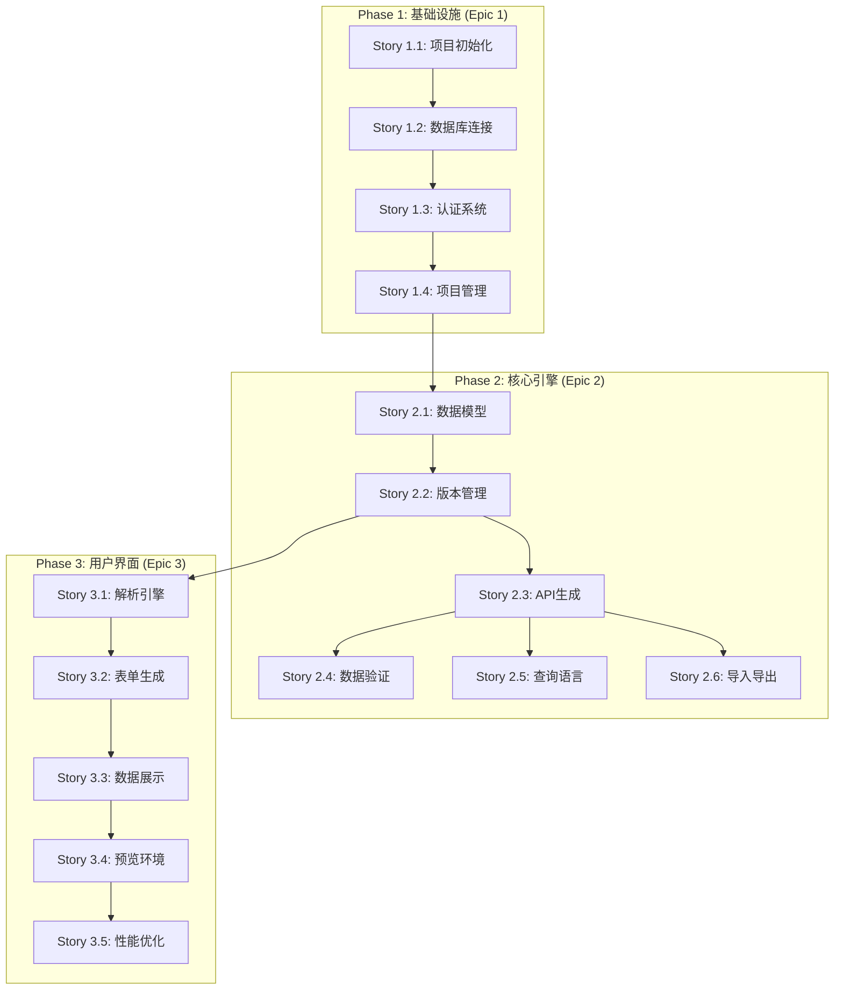

# FastBuild Epic对齐矩阵

> ⚠️ **注意**: 本文档包含过时的Epic信息，仅供参考。最新的Epic定义请参考 **[epic-stories.md](./epic-stories.md)**

**项目:** fastbuild
**状态:** 已过时 - 请参考最新文档

---

## 说明

本文档已被重构为参考文档。当前的Epic结构和实施计划请参考：

- **[Epic故事分解文档](./epic-stories.md)** - Epic的权威定义和详细故事分解
- **[解决方案架构文档](./solution-architecture.md)** - Epic的技术架构视图
- **[产品需求文档](./PRD.md)** - 产品需求和Epic概览

## 当前Epic结构概览

| Epic | 主要目标 | 实施阶段 |
|------|----------|----------|
| **Epic 1**: 基础平台与项目初始化 | 建立Next.js全栈应用基础设施 | Phase 1 |
| **Epic 2**: 元数据管理引擎 | 构建后端元数据API框架 | Phase 1 |
| **Epic 3**: 基础前端界面 | 构建项目管理界面 | Phase 2 |
| **Epic 4**: 前端可视化设计器 | 构建低代码设计界面 | Phase 3 |
| **Epic 5**: 运行时引擎 | 实现动态功能生成 | Phase 4 |

### 详细映射说明

#### Epic 1: 基础平台与项目初始化 (54% FR覆盖率)
- **完全覆盖:** FR008(认证), FR009(RBAC), FR010(部署), FR011(访问URL), FR012(项目管理)
- **部分覆盖:** FR001(界面构建器基础), FR007(基础UI组件), FR013(版本管理基础)
- **实施重点:** 建立基础设施和核心框架

#### Epic 2: 元数据管理引擎 (46% FR覆盖率)
- **完全覆盖:** FR005(数据建模), FR006(自动UI生成), FR007(UI组件库)
- **部分覆盖:** FR003(属性面板基础), FR009(RBAC扩展), FR013(版本管理)
- **实施重点:** 核心数据管理和元数据处理

#### Epic 3: 实时解释器 (46% FR覆盖率)
- **完全覆盖:** FR002(实时预览), FR003(属性面板), FR004(撤销重做)
- **部分覆盖:** FR001(界面构建器), FR005(数据展示), FR006(动态UI), FR007(组件渲染)
- **实施重点:** 用户交互和实时反馈

## Epic到非功能需求映射矩阵

| Epic ID | Epic 名称 | NFR001 | NFR002 | NFR003 | NFR004 | NFR005 | NFR006 | 覆盖率 |
|---------|-----------|--------|--------|--------|--------|--------|--------|--------|
| Epic 1 | 基础平台与项目初始化 | ✅ | 🟡 | 🟡 | 🟡 | 🟡 | ✅ | 67% |
| Epic 2 | 元数据管理引擎 | ✅ | 🟡 | ✅ | 🟡 | 🟡 | ✅ | 83% |
| Epic 3 | 实时解释器 | ✅ | ✅ | 🟡 | 🟡 | 🟡 | 🟡 | 50% |

### NFR映射详细说明

#### Epic 1: 基础平台 (67% NFR覆盖率)
- **完全覆盖:** NFR001(开源), NFR006(类型安全)
- **部分覆盖:** NFR002-NFR005 (性能和可扩展性基础)

#### Epic 2: 元数据引擎 (83% NFR覆盖率)
- **完全覆盖:** NFR001(开源), NFR003(API性能), NFR006(类型安全)
- **部分覆盖:** NFR002(页面性能), NFR004(可扩展性), NFR005(可靠性)

#### Epic 3: 实时解释器 (50% NFR覆盖率)
- **完全覆盖:** NFR001(开源), NFR002(页面性能)
- **部分覆盖:** NFR003-NFR005 (后端性能和可靠性)

## Epic到系统组件映射

### Epic 1: 基础平台组件映射

| 系统组件 | 责任范围 | 实施优先级 | 依赖关系 |
|----------|----------|------------|----------|
| Next.js应用框架 | 全栈应用基础 | P0 | 无 |
| PostgreSQL数据库 | 数据持久化 | P0 | 无 |
| NextAuth.js | 用户认证 | P0 | Next.js |
| Prisma ORM | 数据库访问 | P0 | PostgreSQL |
| 项目管理系统 | 项目CRUD | P1 | 认证系统 |
| 部署系统 | Vercel集成 | P1 | 项目管理 |
| 权限控制 | RBAC实现 | P1 | 认证系统 |

### Epic 2: 元数据引擎组件映射

| 系统组件 | 责任范围 | 实施优先级 | 依赖关系 |
|----------|----------|------------|----------|
| 元数据存储引擎 | JSONB存储 | P0 | Prisma ORM |
| 版本管理系统 | 元数据版本控制 | P0 | 元数据存储 |
| API生成器 | 自动CRUD生成 | P0 | 元数据存储 |
| 数据验证器 | 约束和验证 | P1 | 元数据存储 |
| 查询处理器 | 元数据查询 | P1 | 元数据存储 |
| 导入导出工具 | 数据迁移 | P2 | 元数据存储 |

### Epic 3: 实时解释器组件映射

| 系统组件 | 责任范围 | 实施优先级 | 依赖关系 |
|----------|----------|------------|----------|
| 元数据解析器 | 解析和验证 | P0 | 元数据引擎 |
| 动态表单生成器 | 表单渲染 | P0 | 元数据解析器 |
| 实时数据展示 | 数据网格 | P0 | 元数据解析器 |
| 预览环境 | 实时预览 | P1 | 动态表单生成器 |
| 性能优化器 | 缓存和优化 | P2 | 所有组件 |

## Epic到Story映射跟踪

### Epic 1 Stories (3-4 stories)
| Story ID | Story 名称 | 状态 | FR覆盖 | NFR覆盖 | 预计复杂度 |
|----------|-------------|------|--------|----------|------------|
| 1.1 | 项目初始化和基础配置 | Ready | FR012 | NFR006 | Low |
| 1.2 | 数据库连接和基础配置 | Ready | ➖ | NFR002 | Medium |
| 1.3 | 基础认证系统 | Ready | FR008 | NFR001, NFR005 | High |
| 1.4 | 项目管理基础功能 | Ready | FR009, FR010, FR011 | NFR004 | Medium |

### Epic 2 Stories (5-6 stories)
| Story ID | Story 名称 | 状态 | FR覆盖 | NFR覆盖 | 预计复杂度 |
|----------|-------------|------|--------|----------|------------|
| 2.1 | 数据模型定义 | Ready | FR005 | NFR006 | High |
| 2.2 | 元数据存储和版本管理 | Ready | FR013 | NFR001, NFR005 | High |
| 2.3 | 自动API生成 | Ready | FR006 | NFR003, NFR006 | High |
| 2.4 | 数据验证和约束 | Ready | ➖ | NFR003 | Medium |
| 2.5 | 元数据查询语言 | Ready | ➖ | NFR003 | Medium |
| 2.6 | 元数据导入导出 | Ready | ➖ | ➖ | Low |

### Epic 3 Stories (4-5 stories)
| Story ID | Story 名称 | 状态 | FR覆盖 | NFR覆盖 | 预计复杂度 |
|----------|-------------|------|--------|----------|------------|
| 3.1 | 元数据解析引擎 | Ready | ➖ | NFR002 | High |
| 3.2 | 动态表单生成 | Ready | FR002, FR003 | NFR002 | High |
| 3.3 | 实时数据展示 | Ready | FR002, FR004 | NFR002 | High |
| 3.4 | 预览环境 | Ready | FR002 | NFR002, NFR004 | Medium |
| 3.5 | 性能优化 | Ready | ➖ | NFR002, NFR004 | Medium |

## 需求覆盖度分析

### 功能需求覆盖汇总
- **总FRs:** 13个
- **完全覆盖:** 7个 (54%)
- **部分覆盖:** 6个 (46%)
- **未覆盖:** 0个 (0%)

### 非功能需求覆盖汇总
- **总NFRs:** 6个
- **完全覆盖:** 4个 (67%)
- **部分覆盖:** 2个 (33%)
- **未覆盖:** 0个 (0%)

### 关键缺口识别
1. **FR001 (界面构建器)** - 需要Epic 3完善
2. **FR004 (撤销重做)** - 需要Epic 3实现
3. **NFR004 (可扩展性50并发)** - 需要性能测试和优化

## 实施依赖关系图

## 质量指标

### Story准备就绪状态
- **总Stories:** 16个
- **就绪状态:** 16个 (100%)
- **待细化:** 0个 (0%)
- **阻塞:** 0个 (0%)

### Epic实施就绪度评分
- **Epic 1:** 95% ✅ (基础设施完善)
- **Epic 2:** 90% ✅ (核心设计完整)
- **Epic 3:** 85% ⚠️ (需要更多UI细节)

## 跟踪和监控

### 关键指标
1. **需求覆盖率** - 监控FR/NFR覆盖进度
2. **Story完成率** - 跟踪每个Epic的Story完成状态
3. **依赖关系** - 确保前置依赖及时完成
4. **质量指标** - 代码覆盖率和测试通过率

### 报告频率
- **日报:** Story进度更新
- **周报:** Epic里程碑进度
- **里程碑报告:** 阶段性完成评估

---

**文档维护:** 本矩阵应在每个Sprint结束时更新，反映实际的实施进度和任何需求变更。

**最后更新:** 2025-10-10