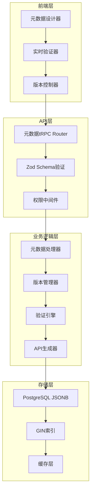

# Epic 2 技术规格文档
## 元数据管理引擎

**Epic ID:** EPIC-002
**Epic 名称:** 元数据管理引擎
**技术负责人:** 开发团队
**文档版本:** 1.0
**最后更新:** 2025-10-10

---

## 概述

### Epic目标
构建功能完备但最小化的元数据管理核心，支持完整的元数据生命周期管理。

### 技术里程碑
元数据API完整可用，支持版本管理和验证

### 技术范围
- JSONB优先的元数据存储架构
- 实时元数据验证引擎
- 版本管理和差异比较
- 自动API生成系统
- 元数据查询和索引
- 导入导出功能

## 系统架构

### 元数据引擎架构图


### 核心组件设计
```typescript
// 元数据引擎核心接口
interface MetadataEngine {
  // 元数据处理
  createMetadata(input: CreateMetadataInput): Promise<Metadata>;
  updateMetadata(id: string, input: UpdateMetadataInput): Promise<Metadata>;
  deleteMetadata(id: string): Promise<boolean>;
  getMetadata(id: string): Promise<Metadata | null>;

  // 版本管理
  createVersion(metadataId: string): Promise<Version>;
  getVersionHistory(metadataId: string): Promise<Version[]>;
  compareVersions(v1Id: string, v2Id: string): Promise<VersionDiff>;
  rollbackToVersion(metadataId: string, versionId: string): Promise<Metadata>;

  // 验证
  validateMetadata(metadata: Metadata): Promise<ValidationResult>;
  validateSchema(schema: MetadataSchema): Promise<SchemaValidationResult>;

  // 查询
  queryMetadata(query: MetadataQuery): Promise<Metadata[]>;
  searchMetadata(search: MetadataSearch): Promise<MetadataSearchResult>;
}

interface Metadata {
  id: string;
  type: 'table' | 'view' | 'application' | 'component';
  name: string;
  schema: MetadataSchema;
  data: Record<string, any>;
  version: number;
  projectId: string;
  createdAt: Date;
  updatedAt: Date;
  createdBy: string;
  updatedBy: string;
}

interface MetadataSchema {
  type: string;
  properties: Record<string, PropertySchema>;
  required: string[];
  relationships: RelationshipSchema[];
  constraints: ConstraintSchema[];
}
```

## 数据模型设计

### 扩展的数据库模型
```prisma
// 元数据模型
model Metadata {
  id          String      @id @default(cuid())
  type        MetadataType
  name        String
  slug        String      @unique
  schema      Json        // Zod schema定义
  data        Json        // 实际元数据
  version     Int         @default(1)
  projectId   String
  createdBy   String
  updatedBy   String
  createdAt   DateTime    @default(now())
  updatedAt   DateTime    @updatedAt

  // 关系
  project     Project     @relation(fields: [projectId], references: [id], onDelete: Cascade)
  creator     User        @relation("MetadataCreator", fields: [createdBy], references: [id])
  updater     User        @relation("MetadataUpdater", fields: [updatedBy], references: [id])
  versions    MetadataVersion[]
  references  MetadataReference[] @relation("ReferencedMetadata")
  referencedBy MetadataReference[] @relation("ReferencingMetadata")
  validations MetadataValidation[]

  @@index([projectId, type])
  @@index([slug])
  @@index([createdAt])
  @@map("metadata")
}

// 元数据版本模型
model MetadataVersion {
  id          String   @id @default(cuid())
  metadataId  String
  version     Int
  schema      Json
  data        Json
  changeLog   String?  // 变更说明
  createdBy   String
  createdAt   DateTime @default(now())

  // 关系
  metadata    Metadata @relation(fields: [metadataId], references: [id], onDelete: Cascade)
  creator     User     @relation(fields: [createdBy], references: [id])

  @@unique([metadataId, version])
  @@index([metadataId])
  @@index([createdAt])
  @@map("metadata_versions")
}

// 元数据引用关系
model MetadataReference {
  id               String @id @default(cuid())
  sourceId         String
  targetId         String
  referenceType    ReferenceType
  sourceProperty   String? // 源对象中的属性名
  targetProperty   String? // 目标对象中的属性名
  createdAt        DateTime @default(now())

  // 关系
  source           Metadata @relation("ReferencingMetadata", fields: [sourceId], references: [id], onDelete: Cascade)
  target           Metadata @relation("ReferencedMetadata", fields: [targetId], references: [id], onDelete: Cascade)

  @@unique([sourceId, targetId, sourceProperty])
  @@index([sourceId])
  @@index([targetId])
  @@map("metadata_references")
}

// 元数据验证结果
model MetadataValidation {
  id            String @id @default(cuid())
  metadataId    String
  schemaVersion Int
  isValid       Boolean
  errors        Json?  // 验证错误详情
  warnings      Json?  // 验证警告
  validatedBy   String
  validatedAt   DateTime @default(now())

  // 关系
  metadata      Metadata @relation(fields: [metadataId], references: [id], onDelete: Cascade)

  @@index([metadataId])
  @@index([validatedAt])
  @@map("metadata_validations")
}

// 自动生成的API端点
model GeneratedEndpoint {
  id            String @id @default(cuid())
  metadataId    String
  endpointType  EndpointType
  path          String
  method        HttpMethod
  schema        Json   // OpenAPI schema
  isActive      Boolean @default(true)
  generatedAt   DateTime @default(now())
  regeneratedAt DateTime @updatedAt

  // 关系
  metadata      Metadata @relation(fields: [metadataId], references: [id], onDelete: Cascade)

  @@unique([metadataId, endpointType, path, method])
  @@index([metadataId])
  @@index([path])
  @@map("generated_endpoints")
}

// 枚举类型
enum MetadataType {
  TABLE
  VIEW
  APPLICATION
  COMPONENT
  LAYOUT
  THEME
}

enum ReferenceType {
  DEPENDS_ON
  EXTENDS
  INCLUDES
  REFERENCES
  IMPLEMENTS
}

enum EndpointType {
  CRUD
  QUERY
  MUTATION
  SUBSCRIPTION
}

enum HttpMethod {
  GET
  POST
  PUT
  DELETE
  PATCH
}
```

### JSONB索引策略
```sql
-- 元数据JSONB内容的GIN索引
CREATE INDEX idx_metadata_data_gin
ON metadata USING GIN (data jsonb_path_ops);

-- 元数据schema的GIN索引
CREATE INDEX idx_metadata_schema_gin
ON metadata USING GIN (schema jsonb_path_ops);

-- 复合索引用于常见查询
CREATE INDEX idx_metadata_project_type_version
ON metadata (projectId, type, version DESC);

-- 部分索引用于活跃元数据
CREATE INDEX idx_metadata_active
ON metadata (id, updatedAt)
WHERE type IN ('TABLE', 'VIEW', 'APPLICATION');

-- 元数据版本查询优化
CREATE INDEX idx_metadata_version_lookup
ON metadata_versions (metadataId, version DESC);

-- 引用关系索引
CREATE INDEX idx_metadata_refs_source
ON metadata_references (sourceId, referenceType);

CREATE INDEX idx_metadata_refs_target
ON metadata_references (targetId, referenceType);

-- 生成的API端点索引
CREATE INDEX idx_generated_endpoints_active
ON generated_endpoints (path, method)
WHERE isActive = true;
```

## API设计

### 元数据管理API
```typescript
// src/server/api/routers/metadata.ts
import { createTRPCRouter, protectedProcedure } from "~/server/api/trpc";
import { z } from "zod";
import { MetadataEngine } from "~/lib/metadata/engine";
import { metadataSchemas } from "~/lib/metadata/schemas";

export const metadataRouter = createTRPCRouter({
  // 获取元数据列表
  getMetadataList: protectedProcedure
    .input(z.object({
      projectId: z.string(),
      type: z.enum(['TABLE', 'VIEW', 'APPLICATION', 'COMPONENT']).optional(),
      page: z.number().default(1),
      limit: z.number().default(20),
      search: z.string().optional(),
    }))
    .query(async ({ ctx, input }) => {
      const engine = new MetadataEngine(ctx.db);

      return await engine.queryMetadata({
        projectId: input.projectId,
        type: input.type,
        pagination: {
          page: input.page,
          limit: input.limit,
        },
        search: input.search,
      });
    }),

  // 获取单个元数据
  getMetadata: protectedProcedure
    .input(z.object({
      id: z.string(),
      includeVersions: z.boolean().default(false),
      includeReferences: z.boolean().default(false),
    }))
    .query(async ({ ctx, input }) => {
      const engine = new MetadataEngine(ctx.db);

      return await engine.getMetadata(input.id, {
        includeVersions: input.includeVersions,
        includeReferences: input.includeReferences,
      });
    }),

  // 创建元数据
  createMetadata: protectedProcedure
    .input(z.object({
      type: z.enum(['TABLE', 'VIEW', 'APPLICATION', 'COMPONENT']),
      name: z.string().min(1).max(100),
      slug: z.string().min(1).max(100),
      schema: z.any(), // JSON schema
      data: z.any(), // 元数据内容
      projectId: z.string(),
    }))
    .mutation(async ({ ctx, input }) => {
      // 检查项目权限
      await checkProjectPermission(ctx.session.user.id, input.projectId, 'MEMBER');

      const engine = new MetadataEngine(ctx.db);

      // 验证schema
      const schemaValidator = metadataSchemas[input.type];
      const validationResult = schemaValidator.safeParse(input.data);

      if (!validationResult.success) {
        throw new Error(`元数据验证失败: ${validationResult.error.message}`);
      }

      return await engine.createMetadata({
        ...input,
        createdBy: ctx.session.user.id,
        updatedBy: ctx.session.user.id,
      });
    }),

  // 更新元数据
  updateMetadata: protectedProcedure
    .input(z.object({
      id: z.string(),
      name: z.string().min(1).max(100).optional(),
      slug: z.string().min(1).max(100).optional(),
      schema: z.any().optional(),
      data: z.any().optional(),
      createVersion: z.boolean().default(true),
      changeLog: z.string().optional(),
    }))
    .mutation(async ({ ctx, input }) => {
      const engine = new MetadataEngine(ctx.db);

      // 获取现有元数据并检查权限
      const existing = await engine.getMetadata(input.id);
      if (!existing) {
        throw new Error("元数据不存在");
      }

      await checkProjectPermission(ctx.session.user.id, existing.projectId, 'MEMBER');

      // 如果提供了新数据，验证schema
      if (input.data) {
        const schemaValidator = metadataSchemas[existing.type];
        const validationResult = schemaValidator.safeParse(input.data);

        if (!validationResult.success) {
          throw new Error(`元数据验证失败: ${validationResult.error.message}`);
        }
      }

      return await engine.updateMetadata(input.id, {
        ...input,
        updatedBy: ctx.session.user.id,
      });
    }),

  // 删除元数据
  deleteMetadata: protectedProcedure
    .input(z.object({ id: z.string() }))
    .mutation(async ({ ctx, input }) => {
      const engine = new MetadataEngine(ctx.db);

      // 检查权限
      const existing = await engine.getMetadata(input.id);
      if (!existing) {
        throw new Error("元数据不存在");
      }

      await checkProjectPermission(ctx.session.user.id, existing.projectId, 'ADMIN');

      // 检查依赖关系
      const references = await engine.getReferences(input.id);
      if (references.length > 0) {
        throw new Error("无法删除：存在其他元数据引用此项");
      }

      return await engine.deleteMetadata(input.id);
    }),

  // 验证元数据
  validateMetadata: protectedProcedure
    .input(z.object({
      id: z.string(),
      schemaVersion: z.number().optional(),
    }))
    .mutation(async ({ ctx, input }) => {
      const engine = new MetadataEngine(ctx.db);

      return await engine.validateMetadata(input.id, {
        schemaVersion: input.schemaVersion,
        validatedBy: ctx.session.user.id,
      });
    }),

  // 获取版本历史
  getVersionHistory: protectedProcedure
    .input(z.object({
      metadataId: z.string(),
      page: z.number().default(1),
      limit: z.number().default(10),
    }))
    .query(async ({ ctx, input }) => {
      const engine = new MetadataEngine(ctx.db);

      return await engine.getVersionHistory(input.metadataId, {
        page: input.page,
        limit: input.limit,
      });
    }),

  // 比较版本
  compareVersions: protectedProcedure
    .input(z.object({
      metadataId: z.string(),
      fromVersion: z.number(),
      toVersion: z.number(),
    }))
    .mutation(async ({ ctx, input }) => {
      const engine = new MetadataEngine(ctx.db);

      return await engine.compareVersions(
        input.metadataId,
        input.fromVersion,
        input.toVersion
      );
    }),

  // 回滚到指定版本
  rollbackToVersion: protectedProcedure
    .input(z.object({
      metadataId: z.string(),
      version: z.number(),
      changeLog: z.string().optional(),
    }))
    .mutation(async ({ ctx, input }) => {
      const engine = new MetadataEngine(ctx.db);

      // 检查权限
      const existing = await engine.getMetadata(input.metadataId);
      if (existing) {
        await checkProjectPermission(ctx.session.user.id, existing.projectId, 'ADMIN');
      }

      return await engine.rollbackToVersion(
        input.metadataId,
        input.version,
        {
          changeLog: input.changeLog,
          updatedBy: ctx.session.user.id,
        }
      );
    }),
});
```

### 元数据Schema定义
```typescript
// src/lib/metadata/schemas.ts
import { z } from "zod";

// 表元数据schema
export const tableSchema = z.object({
  id: z.string(),
  name: z.string().min(1).max(100),
  label: z.string().min(1).max(200),
  description: z.string().optional(),
  columns: z.array(z.object({
    id: z.string(),
    name: z.string().min(1).max(100),
    label: z.string().min(1).max(200),
    type: z.enum([
      'string', 'number', 'boolean', 'date', 'datetime',
      'text', 'json', 'uuid', 'email', 'url', 'phone'
    ]),
    required: z.boolean().default(false),
    unique: z.boolean().default(false),
    default: z.any().optional(),
    validation: z.object({
      min: z.number().optional(),
      max: z.number().optional(),
      pattern: z.string().optional(),
      options: z.array(z.string()).optional(),
    }).optional(),
  })),
  indexes: z.array(z.object({
    name: z.string(),
    columns: z.array(z.string()),
    unique: z.boolean().default(false),
  })).optional(),
  constraints: z.array(z.object({
    name: z.string(),
    type: z.enum(['PRIMARY_KEY', 'FOREIGN_KEY', 'UNIQUE', 'CHECK']),
    columns: z.array(z.string()),
    reference: z.object({
      table: z.string().optional(),
      columns: z.array(z.string()).optional(),
    }).optional(),
  })).optional(),
});

// 视图元数据schema
export const viewSchema = z.object({
  id: z.string(),
  name: z.string().min(1).max(100),
  label: z.string().min(1).max(200),
  description: z.string().optional(),
  sourceTableId: z.string(),
  type: z.enum(['LIST', 'DETAIL', 'FORM', 'DASHBOARD']),
  filters: z.array(z.object({
    field: z.string(),
    operator: z.enum(['=', '!=', '>', '<', '>=', '<=', 'LIKE', 'IN', 'NOT_IN']),
    value: z.any(),
  })).optional(),
  sorts: z.array(z.object({
    field: z.string(),
    direction: z.enum(['ASC', 'DESC']),
  })).optional(),
  fields: z.array(z.object({
    sourceColumnId: z.string(),
    alias: z.string(),
    label: z.string(),
    type: z.string(),
    format: z.string().optional(),
  })),
  pagination: z.object({
    enabled: z.boolean().default(true),
    pageSize: z.number().default(20),
  }).optional(),
});

// 应用元数据schema
export const applicationSchema = z.object({
  id: z.string(),
  name: z.string().min(1).max(100),
  label: z.string().min(1).max(200),
  description: z.string().optional(),
  theme: z.string().optional(),
  layout: z.string().optional(),
  pages: z.array(z.object({
    id: z.string(),
    name: z.string().min(1).max(100),
    label: z.string().min(1).max(200),
    path: z.string().min(1),
    type: z.enum(['LIST', 'DETAIL', 'FORM', 'DASHBOARD', 'CUSTOM']),
    layout: z.array(z.object({
      id: z.string(),
      type: z.enum(['CONTAINER', 'GRID', 'FORM', 'TABLE', 'CHART', 'TEXT', 'IMAGE']),
      config: z.record(z.any()),
      children: z.array(z.any()).optional(),
    })),
    permissions: z.array(z.object({
      role: z.string(),
      permissions: z.array(z.string()),
    })).optional(),
  })),
  navigation: z.array(z.object({
    id: z.string(),
    label: z.string(),
    path: z.string(),
    icon: z.string().optional(),
    children: z.array(z.any()).optional(),
  })).optional(),
});

export const metadataSchemas = {
  TABLE: tableSchema,
  VIEW: viewSchema,
  APPLICATION: applicationSchema,
  COMPONENT: z.any(), // 组件schema根据类型动态定义
};
```

## 元数据处理引擎

### 核心引擎实现
```typescript
// src/lib/metadata/engine.ts
import { PrismaClient } from "@prisma/client";
import { z } from "zod";
import { MetadataEngine as IMetadataEngine, Metadata, CreateMetadataInput } from "./types";
import { metadataSchemas } from "./schemas";
import { MetadataValidator } from "./validator";
import { VersionManager } from "./version-manager";
import { ApiGenerator } from "./api-generator";

export class MetadataEngine implements IMetadataEngine {
  constructor(
    private db: PrismaClient,
    private validator = new MetadataValidator(),
    private versionManager = new VersionManager(db),
    private apiGenerator = new ApiGenerator(db)
  ) {}

  async createMetadata(input: CreateMetadataInput): Promise<Metadata> {
    // 验证输入数据
    const validationResult = this.validateMetadataData(input.type, input.data);
    if (!validationResult.success) {
      throw new Error(`验证失败: ${validationResult.error.message}`);
    }

    // 检查slug唯一性
    const existing = await this.db.metadata.findFirst({
      where: {
        projectId: input.projectId,
        slug: input.slug,
      },
    });

    if (existing) {
      throw new Error("该slug在项目中已存在");
    }

    // 创建元数据
    const metadata = await this.db.metadata.create({
      data: {
        type: input.type,
        name: input.name,
        slug: input.slug,
        schema: input.schema,
        data: input.data,
        version: 1,
        projectId: input.projectId,
        createdBy: input.createdBy,
        updatedBy: input.updatedBy,
      },
    });

    // 创建初始版本
    await this.versionManager.createVersion(metadata.id, {
      version: 1,
      schema: input.schema,
      data: input.data,
      createdBy: input.createdBy,
    });

    // 生成API端点
    await this.apiGenerator.generateEndpoints(metadata);

    return metadata;
  }

  async updateMetadata(id: string, input: UpdateMetadataInput): Promise<Metadata> {
    const existing = await this.db.metadata.findUnique({
      where: { id },
    });

    if (!existing) {
      throw new Error("元数据不存在");
    }

    // 如果更新数据，验证新数据
    if (input.data) {
      const validationResult = this.validateMetadataData(existing.type, input.data);
      if (!validationResult.success) {
        throw new Error(`验证失败: ${validationResult.error.message}`);
      }
    }

    // 检查slug唯一性（如果更改了slug）
    if (input.slug && input.slug !== existing.slug) {
      const slugExists = await this.db.metadata.findFirst({
        where: {
          projectId: existing.projectId,
          slug: input.slug,
          id: { not: id },
        },
      });

      if (slugExists) {
        throw new Error("该slug在项目中已存在");
      }
    }

    // 更新元数据
    const updatedData: any = {
      ...input,
      updatedAt: new Date(),
    };

    if (input.createVersion !== false) {
      updatedData.version = existing.version + 1;
    }

    const metadata = await this.db.metadata.update({
      where: { id },
      data: updatedData,
    });

    // 创建新版本
    if (input.createVersion !== false) {
      await this.versionManager.createVersion(id, {
        version: metadata.version,
        schema: input.schema || existing.schema,
        data: input.data || existing.data,
        createdBy: input.updatedBy,
        changeLog: input.changeLog,
      });
    }

    // 重新生成API端点
    await this.apiGenerator.regenerateEndpoints(metadata);

    return metadata;
  }

  async deleteMetadata(id: string): Promise<boolean> {
    // 检查引用关系
    const references = await this.db.metadataReference.findMany({
      where: { targetId: id },
    });

    if (references.length > 0) {
      throw new Error("无法删除：存在其他元数据引用此项");
    }

    // 删除相关的API端点
    await this.db.generatedEndpoint.deleteMany({
      where: { metadataId: id },
    });

    // 删除元数据
    await this.db.metadata.delete({
      where: { id },
    });

    return true;
  }

  async getMetadata(id: string, options: GetMetadataOptions = {}): Promise<Metadata | null> {
    const metadata = await this.db.metadata.findUnique({
      where: { id },
      include: {
        project: options.includeProject,
        creator: options.includeCreator ? { select: { id: true, name: true, email: true } } : false,
        versions: options.includeVersions ? {
          orderBy: { version: 'desc' },
          take: options.versionLimit || 10,
        } : false,
        references: options.includeReferences ? {
          where: { sourceId: id },
          include: {
            target: { select: { id: true, name: true, type: true } },
          },
        } : false,
        validations: options.includeValidations ? {
          orderBy: { validatedAt: 'desc' },
          take: 1,
        } : false,
      },
    });

    return metadata;
  }

  async queryMetadata(query: MetadataQuery): Promise<MetadataQueryResult> {
    const where: any = {
      projectId: query.projectId,
    };

    if (query.type) {
      where.type = query.type;
    }

    if (query.search) {
      where.OR = [
        { name: { contains: query.search, mode: 'insensitive' } },
        { slug: { contains: query.search, mode: 'insensitive' } },
        // JSONB搜索
        { data: { path: ['label'], string_contains: query.search } },
      ];
    }

    const [metadata, total] = await Promise.all([
      this.db.metadata.findMany({
        where,
        include: {
          creator: { select: { id: true, name: true } },
          versions: { select: { version: true, createdAt: true }, orderBy: { createdAt: 'desc' }, take: 1 },
          validations: { select: { isValid: true, validatedAt: true }, orderBy: { validatedAt: 'desc' }, take: 1 },
        },
        orderBy: { updatedAt: 'desc' },
        skip: (query.pagination.page - 1) * query.pagination.limit,
        take: query.pagination.limit,
      }),
      this.db.metadata.count({ where }),
    ]);

    return {
      metadata,
      pagination: {
        page: query.pagination.page,
        limit: query.pagination.limit,
        total,
        totalPages: Math.ceil(total / query.pagination.limit),
      },
    };
  }

  async validateMetadata(id: string, options: ValidateMetadataOptions): Promise<ValidationResult> {
    const metadata = await this.getMetadata(id);
    if (!metadata) {
      throw new Error("元数据不存在");
    }

    const schemaValidator = metadataSchemas[metadata.type];
    const result = schemaValidator.safeParse(metadata.data);

    const validation = await this.db.metadataValidation.create({
      data: {
        metadataId: id,
        schemaVersion: options.schemaVersion || metadata.version,
        isValid: result.success,
        errors: result.success ? null : result.error.errors,
        validatedBy: options.validatedBy,
      },
    });

    return {
      isValid: result.success,
      errors: result.success ? [] : result.error.errors,
      validationId: validation.id,
      validatedAt: validation.validatedAt,
    };
  }

  private validateMetadataData(type: string, data: any): z.SafeParseReturnType<any, any> {
    const schemaValidator = metadataSchemas[type as keyof typeof metadataSchemas];
    if (!schemaValidator) {
      throw new Error(`不支持的元数据类型: ${type}`);
    }

    return schemaValidator.safeParse(data);
  }
}

// 类型定义
interface CreateMetadataInput {
  type: string;
  name: string;
  slug: string;
  schema: any;
  data: any;
  projectId: string;
  createdBy: string;
  updatedBy: string;
}

interface UpdateMetadataInput {
  name?: string;
  slug?: string;
  schema?: any;
  data?: any;
  createVersion?: boolean;
  changeLog?: string;
  updatedBy: string;
}

interface GetMetadataOptions {
  includeProject?: boolean;
  includeCreator?: boolean;
  includeVersions?: boolean;
  includeReferences?: boolean;
  includeValidations?: boolean;
  versionLimit?: number;
}

interface MetadataQuery {
  projectId: string;
  type?: string;
  search?: string;
  pagination: {
    page: number;
    limit: number;
  };
}

interface MetadataQueryResult {
  metadata: Metadata[];
  pagination: {
    page: number;
    limit: number;
    total: number;
    totalPages: number;
  };
}

interface ValidateMetadataOptions {
  schemaVersion?: number;
  validatedBy: string;
}

interface ValidationResult {
  isValid: boolean;
  errors: any[];
  validationId: string;
  validatedAt: Date;
}
```

### 版本管理器
```typescript
// src/lib/metadata/version-manager.ts
import { PrismaClient } from "@prisma/client";

export class VersionManager {
  constructor(private db: PrismaClient) {}

  async createVersion(
    metadataId: string,
    input: CreateVersionInput
  ): Promise<MetadataVersion> {
    return await this.db.metadataVersion.create({
      data: {
        metadataId,
        version: input.version,
        schema: input.schema,
        data: input.data,
        changeLog: input.changeLog,
        createdBy: input.createdBy,
      },
    });
  }

  async getVersionHistory(
    metadataId: string,
    pagination: { page: number; limit: number }
  ): Promise<VersionHistoryResult> {
    const [versions, total] = await Promise.all([
      this.db.metadataVersion.findMany({
        where: { metadataId },
        include: {
          creator: { select: { id: true, name: true, email: true } },
        },
        orderBy: { version: 'desc' },
        skip: (pagination.page - 1) * pagination.limit,
        take: pagination.limit,
      }),
      this.db.metadataVersion.count({ where: { metadataId } }),
    ]);

    return {
      versions,
      pagination: {
        page: pagination.page,
        limit: pagination.limit,
        total,
        totalPages: Math.ceil(total / pagination.limit),
      },
    };
  }

  async compareVersions(
    metadataId: string,
    fromVersion: number,
    toVersion: number
  ): Promise<VersionDiff> {
    const [from, to] = await Promise.all([
      this.db.metadataVersion.findFirst({
        where: { metadataId, version: fromVersion },
      }),
      this.db.metadataVersion.findFirst({
        where: { metadataId, version: toVersion },
      }),
    ]);

    if (!from || !to) {
      throw new Error("版本不存在");
    }

    const diff = this.generateDiff(from.data, to.data);

    return {
      fromVersion: from.version,
      toVersion: to.version,
      fromCreatedAt: from.createdAt,
      toCreatedAt: to.createdAt,
      changes: diff,
      summary: this.generateDiffSummary(diff),
    };
  }

  async rollbackToVersion(
    metadataId: string,
    version: number,
    options: RollbackOptions
  ): Promise<Metadata> {
    const targetVersion = await this.db.metadataVersion.findFirst({
      where: { metadataId, version },
    });

    if (!targetVersion) {
      throw new Error("目标版本不存在");
    }

    // 创建新版本（基于回滚目标）
    const currentMetadata = await this.db.metadata.findUnique({
      where: { id: metadataId },
    });

    if (!currentMetadata) {
      throw new Error("元数据不存在");
    }

    const rollbackVersion = currentMetadata.version + 1;

    // 更新元数据
    const updatedMetadata = await this.db.metadata.update({
      where: { id: metadataId },
      data: {
        schema: targetVersion.schema,
        data: targetVersion.data,
        version: rollbackVersion,
        updatedBy: options.updatedBy,
        updatedAt: new Date(),
      },
    });

    // 创建版本记录
    await this.createVersion(metadataId, {
      version: rollbackVersion,
      schema: targetVersion.schema,
      data: targetVersion.data,
      changeLog: `回滚到版本 ${version}${options.changeLog ? `: ${options.changeLog}` : ''}`,
      createdBy: options.updatedBy,
    });

    return updatedMetadata;
  }

  private generateDiff(fromData: any, toData: any): DiffChange[] {
    const changes: DiffChange[] = [];

    // 简单的JSON diff实现（实际项目中建议使用专门的diff库）
    const diff = this.jsonDiff(fromData, toData);

    for (const [path, change] of Object.entries(diff)) {
      changes.push({
        path,
        type: change.type,
        oldValue: change.oldValue,
        newValue: change.newValue,
      });
    }

    return changes;
  }

  private jsonDiff(obj1: any, obj2: any, path: string = ''): Record<string, any> {
    const diff: Record<string, any> = {};

    // 获取所有键
    const keys = new Set([...Object.keys(obj1 || {}), ...Object.keys(obj2 || {})]);

    for (const key of keys) {
      const currentPath = path ? `${path}.${key}` : key;
      const val1 = obj1?.[key];
      const val2 = obj2?.[key];

      if (val1 === val2) {
        continue;
      }

      if (typeof val1 !== typeof val2) {
        diff[currentPath] = {
          type: 'TYPE_CHANGE',
          oldValue: val1,
          newValue: val2,
        };
      } else if (Array.isArray(val1) && Array.isArray(val2)) {
        const arrayDiff = this.arrayDiff(val1, val2, currentPath);
        Object.assign(diff, arrayDiff);
      } else if (typeof val1 === 'object' && typeof val2 === 'object' && val1 !== null && val2 !== null) {
        const nestedDiff = this.jsonDiff(val1, val2, currentPath);
        Object.assign(diff, nestedDiff);
      } else {
        diff[currentPath] = {
          type: val1 === undefined ? 'ADD' : val2 === undefined ? 'DELETE' : 'CHANGE',
          oldValue: val1,
          newValue: val2,
        };
      }
    }

    return diff;
  }

  private arrayDiff(arr1: any[], arr2: any[], path: string): Record<string, any> {
    const diff: Record<string, any> = {};
    const maxLength = Math.max(arr1.length, arr2.length);

    for (let i = 0; i < maxLength; i++) {
      const currentPath = `${path}[${i}]`;
      const val1 = arr1[i];
      const val2 = arr2[i];

      if (val1 === val2) {
        continue;
      }

      if (val1 === undefined) {
        diff[currentPath] = {
          type: 'ADD',
          oldValue: val1,
          newValue: val2,
        };
      } else if (val2 === undefined) {
        diff[currentPath] = {
          type: 'DELETE',
          oldValue: val1,
          newValue: val2,
        };
      } else if (typeof val1 !== typeof val2) {
        diff[currentPath] = {
          type: 'TYPE_CHANGE',
          oldValue: val1,
          newValue: val2,
        };
      } else if (typeof val1 === 'object' && typeof val2 === 'object') {
        const nestedDiff = this.jsonDiff(val1, val2, currentPath);
        Object.assign(diff, nestedDiff);
      } else {
        diff[currentPath] = {
          type: 'CHANGE',
          oldValue: val1,
          newValue: val2,
        };
      }
    }

    return diff;
  }

  private generateDiffSummary(changes: DiffChange[]): string {
    const changeCounts = changes.reduce((acc, change) => {
      acc[change.type] = (acc[change.type] || 0) + 1;
      return acc;
    }, {} as Record<string, number>);

    const summaryParts = Object.entries(changeCounts).map(([type, count]) => {
      const typeLabel = {
        CHANGE: '修改',
        ADD: '添加',
        DELETE: '删除',
        TYPE_CHANGE: '类型变更',
      }[type] || type;

      return `${count}个${typeLabel}`;
    });

    return summaryParts.join('，');
  }
}

// 类型定义
interface CreateVersionInput {
  version: number;
  schema: any;
  data: any;
  changeLog?: string;
  createdBy: string;
}

interface VersionHistoryResult {
  versions: MetadataVersion[];
  pagination: {
    page: number;
    limit: number;
    total: number;
    totalPages: number;
  };
}

interface VersionDiff {
  fromVersion: number;
  toVersion: number;
  fromCreatedAt: Date;
  toCreatedAt: Date;
  changes: DiffChange[];
  summary: string;
}

interface DiffChange {
  path: string;
  type: 'ADD' | 'DELETE' | 'CHANGE' | 'TYPE_CHANGE';
  oldValue?: any;
  newValue?: any;
}

interface RollbackOptions {
  changeLog?: string;
  updatedBy: string;
}
```

## 前端组件设计

### 元数据设计器组件
```typescript
// src/components/metadata/metadata-designer.tsx
"use client";

import { useState, useCallback } from "react";
import { api } from "~/trpc/react";
import { Card, CardContent, CardDescription, CardHeader, CardTitle } from "~/components/ui/card";
import { Button } from "~/components/ui/button";
import { Input } from "~/components/ui/input";
import { Tabs, TabsContent, TabsList, TabsTrigger } from "~/components/ui/tabs";
import { MetadataForm } from "./metadata-form";
import { MetadataPreview } from "./metadata-preview";
import { MetadataValidation } from "./metadata-validation";

interface MetadataDesignerProps {
  projectId: string;
  initialMetadata?: Metadata;
  onSave: (metadata: Metadata) => void;
  onCancel: () => void;
}

export function MetadataDesigner({
  projectId,
  initialMetadata,
  onSave,
  onCancel
}: MetadataDesignerProps) {
  const [activeTab, setActiveTab] = useState("design");
  const [metadata, setMetadata] = useState<Partial<Metadata>>(
    initialMetadata || {
      type: "TABLE",
      name: "",
      slug: "",
      data: {},
    }
  );

  const createMutation = api.metadata.createMetadata.useMutation({
    onSuccess: onSave,
  });

  const updateMutation = api.metadata.updateMetadata.useMutation({
    onSuccess: onSave,
  });

  const validationQuery = api.metadata.validateMetadata.useQuery(
    { id: initialMetadata?.id || "" },
    { enabled: !!initialMetadata?.id }
  );

  const handleSave = useCallback(() => {
    if (!metadata.name || !metadata.slug || !metadata.type) {
      return;
    }

    if (initialMetadata?.id) {
      updateMutation.mutate({
        id: initialMetadata.id,
        name: metadata.name,
        slug: metadata.slug,
        data: metadata.data,
        createVersion: true,
        changeLog: "通过设计器更新",
      });
    } else {
      createMutation.mutate({
        type: metadata.type,
        name: metadata.name,
        slug: metadata.slug,
        schema: {},
        data: metadata.data,
        projectId,
      });
    }
  }, [metadata, initialMetadata, projectId, createMutation, updateMutation]);

  const isFormValid = metadata.name && metadata.slug && metadata.type;

  return (
    <div className="max-w-6xl mx-auto p-6">
      <div className="flex justify-between items-center mb-6">
        <h1 className="text-2xl font-bold">
          {initialMetadata ? "编辑元数据" : "创建元数据"}
        </h1>
        <div className="flex space-x-2">
          <Button variant="outline" onClick={onCancel}>
            取消
          </Button>
          <Button
            onClick={handleSave}
            disabled={!isFormValid || createMutation.isPending || updateMutation.isPending}
          >
            {initialMetadata ? "更新" : "创建"}
          </Button>
        </div>
      </div>

      <Tabs value={activeTab} onValueChange={setActiveTab}>
        <TabsList className="grid w-full grid-cols-4">
          <TabsTrigger value="design">设计</TabsTrigger>
          <TabsTrigger value="preview">预览</TabsTrigger>
          <TabsTrigger value="validation">验证</TabsTrigger>
          <TabsTrigger value="history">历史</TabsTrigger>
        </TabsList>

        <TabsContent value="design" className="mt-6">
          <Card>
            <CardHeader>
              <CardTitle>元数据设计</CardTitle>
              <CardDescription>
                配置元数据的结构和属性
              </CardDescription>
            </CardHeader>
            <CardContent>
              <MetadataForm
                metadata={metadata}
                onChange={setMetadata}
              />
            </CardContent>
          </Card>
        </TabsContent>

        <TabsContent value="preview" className="mt-6">
          <Card>
            <CardHeader>
              <CardTitle>实时预览</CardTitle>
              <CardDescription>
                查看元数据的实时效果
              </CardDescription>
            </CardHeader>
            <CardContent>
              <MetadataPreview
                type={metadata.type!}
                data={metadata.data}
              />
            </CardContent>
          </Card>
        </TabsContent>

        <TabsContent value="validation" className="mt-6">
          <Card>
            <CardHeader>
              <CardTitle>验证结果</CardTitle>
              <CardDescription>
                检查元数据的结构和约束
              </CardDescription>
            </CardHeader>
            <CardContent>
              <MetadataValidation
                metadata={metadata}
                validation={validationQuery.data}
                onValidate={() => {
                  if (initialMetadata?.id) {
                    validationQuery.refetch();
                  }
                }}
              />
            </CardContent>
          </Card>
        </TabsContent>

        <TabsContent value="history" className="mt-6">
          <Card>
            <CardHeader>
              <CardTitle>版本历史</CardTitle>
              <CardDescription>
                查看元数据的变更历史
              </CardDescription>
            </CardHeader>
            <CardContent>
              {initialMetadata?.id ? (
                <MetadataHistory metadataId={initialMetadata.id} />
              ) : (
                <p className="text-gray-500">保存元数据后查看历史</p>
              )}
            </CardContent>
          </Card>
        </TabsContent>
      </Tabs>
    </div>
  );
}
```

## 性能优化策略

### 查询优化
```typescript
// src/lib/metadata/query-optimizer.ts
export class MetadataQueryOptimizer {
  constructor(private db: PrismaClient) {}

  // 批量查询优化
  async getMetadataWithRelations(metadataIds: string[]): Promise<MetadataWithRelations[]> {
    return await this.db.metadata.findMany({
      where: {
        id: { in: metadataIds },
      },
      include: {
        project: {
          select: { id: true, name: true },
        },
        creator: {
          select: { id: true, name: true, email: true },
        },
        versions: {
          select: { version: true, createdAt: true },
          orderBy: { createdAt: 'desc' },
          take: 1,
        },
        references: {
          include: {
            target: {
              select: { id: true, name: true, type: true },
            },
          },
        },
        validations: {
          select: { isValid: true, validatedAt: true },
          orderBy: { validatedAt: 'desc' },
          take: 1,
        },
      },
    });
  }

  // 分页查询优化
  async getPaginatedMetadata(query: OptimizedMetadataQuery): Promise<PaginatedResult<Metadata>> {
    const offset = (query.page - 1) * query.limit;

    // 使用游标分页优化大数据集
    if (query.useCursor && query.cursor) {
      return this.getCursorPaginatedMetadata(query);
    }

    // 标准分页
    const [metadata, total] = await Promise.all([
      this.db.metadata.findMany({
        where: this.buildWhereClause(query),
        select: this.buildSelectClause(query),
        orderBy: this.buildOrderByClause(query),
        skip: offset,
        take: query.limit,
      }),
      this.db.metadata.count({
        where: this.buildWhereClause(query),
      }),
    ]);

    return {
      data: metadata,
      pagination: {
        page: query.page,
        limit: query.limit,
        total,
        totalPages: Math.ceil(total / query.limit),
        hasNext: offset + metadata.length < total,
        hasPrev: query.page > 1,
      },
    };
  }

  // 搜索优化
  async searchMetadata(search: MetadataSearch): Promise<SearchResult<Metadata>> {
    // 使用PostgreSQL全文搜索
    const searchQuery = this.buildSearchQuery(search);

    const results = await this.db.$queryRaw`
      SELECT
        m.*,
        ts_rank_cd(search_vector, plainto_tsquery('english', ${search.query})) as rank
      FROM metadata m
      WHERE
        m.project_id = ${search.projectId}
        AND search_vector @@ plainto_tsquery('english', ${search.query})
      ORDER BY rank DESC
      LIMIT ${search.limit || 20}
    `;

    return {
      results: results as any[],
      query: search.query,
      total: results.length,
    };
  }

  private buildWhereClause(query: OptimizedMetadataQuery): any {
    const where: any = {
      projectId: query.projectId,
    };

    if (query.type) {
      where.type = query.type;
    }

    if (query.filters) {
      Object.assign(where, this.buildFilters(query.filters));
    }

    return where;
  }

  private buildSelectClause(query: OptimizedMetadataQuery): any {
    const baseSelect = {
      id: true,
      type: true,
      name: true,
      slug: true,
      version: true,
      createdAt: true,
      updatedAt: true,
    };

    if (query.includeRelations) {
      baseSelect.project = { select: { id: true, name: true } };
      baseSelect.creator = { select: { id: true, name: true } };
    }

    if (query.includeData) {
      baseSelect.data = true;
      baseSelect.schema = true;
    }

    return baseSelect;
  }

  private buildOrderByClause(query: OptimizedMetadataQuery): any {
    if (query.sortBy) {
      return {
        [query.sortBy]: query.sortDirection || 'desc',
      };
    }

    return { updatedAt: 'desc' };
  }

  private buildFilters(filters: Record<string, any>): any {
    const where: any = {};

    Object.entries(filters).forEach(([key, value]) => {
      if (typeof value === 'string' && value.includes('*')) {
        // 通配符搜索
        where[key] = {
          contains: value.replace(/\*/g, ''),
          mode: 'insensitive',
        };
      } else if (Array.isArray(value)) {
        // 数组过滤
        where[key] = { in: value };
      } else {
        // 精确匹配
        where[key] = value;
      }
    });

    return where;
  }

  private buildSearchQuery(search: MetadataSearch): string {
    // 构建PostgreSQL全文搜索查询
    const terms = search.query.split(/\s+/).filter(Boolean);
    return terms.join(' & ');
  }
}

// 类型定义
interface OptimizedMetadataQuery {
  projectId: string;
  type?: string;
  page: number;
  limit: number;
  filters?: Record<string, any>;
  sortBy?: string;
  sortDirection?: 'asc' | 'desc';
  includeRelations?: boolean;
  includeData?: boolean;
  useCursor?: boolean;
  cursor?: string;
}

interface MetadataSearch {
  projectId: string;
  query: string;
  type?: string;
  limit?: number;
}

interface PaginatedResult<T> {
  data: T[];
  pagination: {
    page: number;
    limit: number;
    total: number;
    totalPages: number;
    hasNext: boolean;
    hasPrev: boolean;
  };
}

interface SearchResult<T> {
  results: T[];
  query: string;
  total: number;
}
```

## 缓存策略

### Redis缓存实现
```typescript
// src/lib/metadata/cache.ts
import Redis from 'ioredis';

export class MetadataCache {
  private redis: Redis;

  constructor() {
    this.redis = new Redis(process.env.REDIS_URL || 'redis://localhost:6379');
  }

  // 缓存元数据
  async cacheMetadata(metadata: Metadata): Promise<void> {
    const key = `metadata:${metadata.id}`;
    const projectKey = `project:${metadata.projectId}:metadata`;

    await Promise.all([
      this.redis.setex(key, 3600, JSON.stringify(metadata)),
      this.redis.sadd(projectKey, metadata.id),
      this.redis.expire(projectKey, 3600),
    ]);
  }

  // 获取缓存的元数据
  async getCachedMetadata(id: string): Promise<Metadata | null> {
    const cached = await this.redis.get(`metadata:${id}`);
    return cached ? JSON.parse(cached) : null;
  }

  // 缓存查询结果
  async cacheQueryResult(
    queryKey: string,
    result: any,
    ttl: number = 300
  ): Promise<void> {
    await this.redis.setex(`query:${queryKey}`, ttl, JSON.stringify(result));
  }

  // 获取缓存的查询结果
  async getCachedQueryResult(queryKey: string): Promise<any | null> {
    const cached = await this.redis.get(`query:${queryKey}`);
    return cached ? JSON.parse(cached) : null;
  }

  // 清除项目相关缓存
  async invalidateProjectCache(projectId: string): Promise<void> {
    const metadataIds = await this.redis.smembers(`project:${projectId}:metadata`);

    const pipeline = this.redis.pipeline();

    // 删除所有元数据缓存
    metadataIds.forEach(id => {
      pipeline.del(`metadata:${id}`);
    });

    // 删除项目元数据集合
    pipeline.del(`project:${projectId}:metadata`);

    // 删除项目相关的查询缓存
    const pattern = `query:project:${projectId}:*`;
    const keys = await this.redis.keys(pattern);
    keys.forEach(key => pipeline.del(key));

    await pipeline.exec();
  }

  // 缓存版本历史
  async cacheVersionHistory(
    metadataId: string,
    history: MetadataVersion[]
  ): Promise<void> {
    const key = `versions:${metadataId}`;
    await this.redis.setex(key, 1800, JSON.stringify(history));
  }

  // 获取缓存的版本历史
  async getCachedVersionHistory(metadataId: string): Promise<MetadataVersion[] | null> {
    const cached = await this.redis.get(`versions:${metadataId}`);
    return cached ? JSON.parse(cached) : null;
  }
}
```

## 监控和日志

### 元数据操作审计
```typescript
// src/lib/metadata/audit.ts
export class MetadataAuditLogger {
  constructor(private db: PrismaClient) {}

  async logMetadataChange(
    metadataId: string,
    action: 'CREATE' | 'UPDATE' | 'DELETE',
    userId: string,
    changes?: any,
    metadata?: {
      type: string;
      projectId: string;
      name: string;
    }
  ): Promise<void> {
    await this.db.auditLog.create({
      data: {
        entity: 'METADATA',
        entityId: metadataId,
        action,
        userId,
        changes: changes ? JSON.stringify(changes) : null,
        metadata: metadata ? JSON.stringify(metadata) : null,
        timestamp: new Date(),
        ipAddress: '', // 从请求上下文获取
        userAgent: '', // 从请求上下文获取
      },
    });

    // 记录关键指标
    await this.recordMetrics(action, metadata);
  }

  private async recordMetrics(
    action: string,
    metadata?: { type: string; projectId: string }
  ): Promise<void> {
    // 记录到监控系统
    const metrics = {
      action,
      type: metadata?.type,
      projectId: metadata?.projectId,
      timestamp: new Date().toISOString(),
    };

    // 发送到监控服务（如Prometheus、DataDog等）
    await this.sendMetrics(metrics);
  }

  private async sendMetrics(metrics: any): Promise<void> {
    // 实现监控指标发送逻辑
    console.log('Metrics:', metrics);
  }

  async getAuditHistory(
    metadataId: string,
    options: {
      page?: number;
      limit?: number;
      actions?: string[];
      userId?: string;
    } = {}
  ): Promise<AuditHistoryResult> {
    const where: any = {
      entity: 'METADATA',
      entityId: metadataId,
    };

    if (options.actions) {
      where.action = { in: options.actions };
    }

    if (options.userId) {
      where.userId = options.userId;
    }

    const [logs, total] = await Promise.all([
      this.db.auditLog.findMany({
        where,
        orderBy: { timestamp: 'desc' },
        skip: ((options.page || 1) - 1) * (options.limit || 20),
        take: options.limit || 20,
        include: {
          user: {
            select: { id: true, name: true, email: true },
          },
        },
      }),
      this.db.auditLog.count({ where }),
    ]);

    return {
      logs,
      pagination: {
        page: options.page || 1,
        limit: options.limit || 20,
        total,
        totalPages: Math.ceil(total / (options.limit || 20)),
      },
    };
  }
}

// 审计日志模型
const auditLogSchema = {
  id: String,
  entity: String, // 'METADATA', 'PROJECT', 'USER'
  entityId: String,
  action: String, // 'CREATE', 'UPDATE', 'DELETE'
  userId: String,
  changes: String, // JSON string
  metadata: String, // JSON string
  timestamp: DateTime,
  ipAddress: String,
  userAgent: String,
};
```

## 发布检查清单

### Epic 2发布前检查
- [ ] 元数据引擎核心功能完成
- [ ] 版本管理系统完整
- [ ] 数据验证机制正常工作
- [ ] 自动API生成功能正常
- [ ] JSONB性能优化完成
- [ ] 缓存系统正常工作
- [ ] 审计日志功能完整
- [ ] 单元测试覆盖率 > 90%
- [ ] 集成测试通过
- [ ] 性能测试满足要求
- [ ] 文档更新完整

### 性能基准
- 元数据创建响应时间 < 200ms
- 元数据查询响应时间 < 100ms
- 版本比较操作 < 500ms
- 批量查询支持 1000+ 条记录
- 并发支持 50+ 用户同时操作

---

**文档维护:** 本技术规格文档应在实施过程中持续更新，反映实际的技术决策和实现细节。

**下一步:** 开始Epic 3的技术规格设计，为实时解释器做准备。