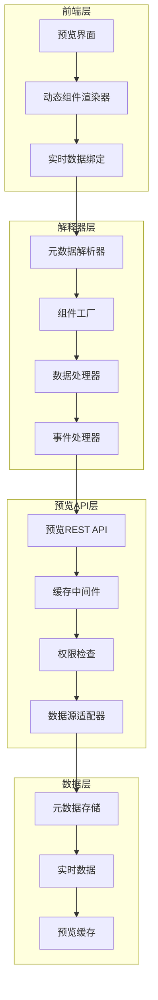

# Epic 3 技术规格文档
## 实时解释器

**Epic ID:** EPIC-003
**Epic 名称:** 实时解释器
**技术负责人:** 开发团队
**文档版本:** 1.0
**最后更新:** 2025-10-10

---

## 概述

### Epic目标
让元数据第一次产生"价值"，通过实时解释器将元数据转换为可交互的用户界面。

### 技术里程碑
元数据驱动的预览API可用

### 技术范围
- 元数据解析引擎
- 动态表单生成器
- 实时数据展示
- 预览环境管理
- 性能优化和缓存

## 系统架构

### 实时解释器架构图


### 核心接口设计
```typescript
// 实时解释器核心接口
interface RealtimeInterpreter {
  // 元数据解析
  parseMetadata(metadata: Metadata): ParsedMetadata;
  validateSchema(schema: MetadataSchema): ValidationResult;
  compileComponent(metadata: ComponentMetadata): CompiledComponent;

  // 动态渲染
  renderComponent(compileOutput: CompiledComponent, data?: any): React.ReactElement;
  renderForm(formMetadata: FormMetadata, data?: any): React.ReactElement;
  renderTable(tableMetadata: TableMetadata, data?: any[]): React.ReactElement;

  // 实时数据绑定
  bindData(component: CompiledComponent, dataSource: DataSource): DataBinding;
  updateData(binding: DataBinding, newData: any): void;

  // 事件处理
  handleEvent(event: ComponentEvent, context: EventContext): Promise<EventResult>;

  // 预览管理
  createPreviewSession(projectId: string): Promise<PreviewSession>;
  updatePreviewData(sessionId: string, updates: any): Promise<void>;
  destroyPreviewSession(sessionId: string): Promise<void>;
}

interface ParsedMetadata {
  id: string;
  type: 'table' | 'view' | 'form' | 'chart';
  schema: ParsedSchema;
  components: ParsedComponent[];
  dataBindings: DataBinding[];
  eventHandlers: EventHandler[];
}

interface CompiledComponent {
  id: string;
  type: string;
  props: Record<string, any>;
  children?: CompiledComponent[];
  dataBindings: DataBinding[];
  eventHandlers: EventHandler[];
  renderFunction: (props: any, data?: any) => React.ReactElement;
}

interface PreviewSession {
  id: string;
  projectId: string;
  metadata: ParsedMetadata;
  data: Record<string, any>;
  createdAt: Date;
  expiresAt: Date;
  isActive: boolean;
}
```

## 元数据解析引擎

### 核心解析器实现
```typescript
// src/lib/interpreter/metadata-parser.ts
import { z } from "zod";
import { Metadata, ParsedMetadata, ParsedComponent } from "./types";

export class MetadataParser {
  private componentRegistry = new ComponentRegistry();
  private validator = new SchemaValidator();

  async parseMetadata(metadata: Metadata): Promise<ParsedMetadata> {
    // 验证schema
    const validationResult = this.validator.validate(metadata.schema, metadata.data);
    if (!validationResult.valid) {
      throw new Error(`元数据验证失败: ${validationResult.errors.join(', ')}`);
    }

    // 根据类型解析
    switch (metadata.type) {
      case 'TABLE':
        return this.parseTableMetadata(metadata);
      case 'VIEW':
        return this.parseViewMetadata(metadata);
      case 'APPLICATION':
        return this.parseApplicationMetadata(metadata);
      default:
        throw new Error(`不支持的元数据类型: ${metadata.type}`);
    }
  }

  private parseTableMetadata(metadata: Metadata): ParsedMetadata {
    const tableData = metadata.data as TableMetadata;

    return {
      id: metadata.id,
      type: 'table',
      schema: this.parseTableSchema(tableData),
      components: this.parseTableComponents(tableData),
      dataBindings: this.parseTableDataBindings(tableData),
      eventHandlers: this.parseTableEventHandlers(tableData),
    };
  }

  private parseViewMetadata(metadata: Metadata): ParsedMetadata {
    const viewData = metadata.data as ViewMetadata;

    return {
      id: metadata.id,
      type: 'view',
      schema: this.parseViewSchema(viewData),
      components: this.parseViewComponents(viewData),
      dataBindings: this.parseViewDataBindings(viewData),
      eventHandlers: this.parseViewEventHandlers(viewData),
    };
  }

  private parseApplicationMetadata(metadata: Metadata): ParsedMetadata {
    const appData = metadata.data as ApplicationMetadata;

    return {
      id: metadata.id,
      type: 'application',
      schema: this.parseApplicationSchema(appData),
      components: await this.parseApplicationComponents(appData),
      dataBindings: this.parseApplicationDataBindings(appData),
      eventHandlers: this.parseApplicationEventHandlers(appData),
    };
  }

  private parseTableSchema(tableData: TableMetadata): ParsedSchema {
    return {
      fields: tableData.columns.map(column => ({
        name: column.name,
        type: this.mapFieldType(column.type),
        label: column.label,
        required: column.required,
        validation: column.validation,
      })),
      relationships: this.parseRelationships(tableData.constraints || []),
      indexes: tableData.indexes || [],
    };
  }

  private parseTableComponents(tableData: TableMetadata): ParsedComponent[] {
    const components: ParsedComponent[] = [];

    // 自动生成表格组件
    components.push({
      id: `${tableData.id}_table`,
      type: 'DataTable',
      config: {
        columns: tableData.columns.map(col => ({
          key: col.name,
          label: col.label,
          type: col.type,
          sortable: true,
          filterable: true,
        })),
        pagination: true,
        selectable: true,
      },
      position: { x: 0, y: 0, width: '100%', height: 'auto' },
    });

    // 自动生成表单组件
    components.push({
      id: `${tableData.id}_form`,
      type: 'DynamicForm',
      config: {
        fields: tableData.columns.map(col => ({
          name: col.name,
          label: col.label,
          type: this.mapFieldTypeToInput(col.type),
          required: col.required,
          validation: col.validation,
        })),
        layout: 'vertical',
        submitText: '保存',
      },
      position: { x: 0, y: 0, width: '100%', height: 'auto' },
    });

    return components;
  }

  private parseViewComponents(viewData: ViewMetadata): ParsedComponent[] {
    const components: ParsedComponent[] = [];

    // 根据视图类型生成组件
    switch (viewData.type) {
      case 'LIST':
        components.push({
          id: `${viewData.id}_list`,
          type: 'DataList',
          config: {
            sourceTableId: viewData.sourceTableId,
            fields: viewData.fields,
            filters: viewData.filters || [],
            sorts: viewData.sorts || [],
            pagination: viewData.pagination,
          },
          position: { x: 0, y: 0, width: '100%', height: 'auto' },
        });
        break;

      case 'FORM':
        components.push({
          id: `${viewData.id}_form`,
          type: 'DynamicForm',
          config: {
            sourceTableId: viewData.sourceTableId,
            fields: viewData.fields.map(field => ({
              name: field.alias,
              label: field.label,
              type: field.type,
              sourceColumnId: field.sourceColumnId,
            })),
          },
          position: { x: 0, y: 0, width: '100%', height: 'auto' },
        });
        break;

      case 'DETAIL':
        components.push({
          id: `${viewData.id}_detail`,
          type: 'DataDetail',
          config: {
            sourceTableId: viewData.sourceTableId,
            fields: viewData.fields,
            layout: 'card',
          },
          position: { x: 0, y: 0, width: '100%', height: 'auto' },
        });
        break;
    }

    return components;
  }

  private async parseApplicationComponents(appData: ApplicationMetadata): Promise<ParsedComponent[]> {
    const components: ParsedComponent[] = [];

    // 解析页面
    for (const page of appData.pages) {
      const pageComponents = await this.parsePageLayout(page.layout, page.id);
      components.push(...pageComponents);
    }

    return components;
  }

  private async parsePageLayout(layout: any[], pageId: string): Promise<ParsedComponent[]> {
    const components: ParsedComponent[] = [];

    for (const layoutItem of layout) {
      const component = await this.parseLayoutItem(layoutItem, pageId);
      if (component) {
        components.push(component);
      }
    }

    return components;
  }

  private async parseLayoutItem(layoutItem: any, pageId: string): Promise<ParsedComponent | null> {
    const componentDefinition = this.componentRegistry.getComponent(layoutItem.type);
    if (!componentDefinition) {
      console.warn(`未知的组件类型: ${layoutItem.type}`);
      return null;
    }

    return {
      id: layoutItem.id,
      type: layoutItem.type,
      config: layoutItem.config,
      children: layoutItem.children ?
        await this.parsePageLayout(layoutItem.children, pageId) :
        undefined,
      position: layoutItem.position || { x: 0, y: 0, width: 'auto', height: 'auto' },
    };
  }

  private mapFieldType(fieldType: string): string {
    const typeMap: Record<string, string> = {
      'string': 'text',
      'number': 'number',
      'boolean': 'boolean',
      'date': 'date',
      'datetime': 'datetime',
      'text': 'textarea',
      'json': 'json',
      'email': 'email',
      'url': 'url',
      'phone': 'tel',
    };

    return typeMap[fieldType] || 'text';
  }

  private mapFieldTypeToInput(fieldType: string): string {
    const inputMap: Record<string, string> = {
      'string': 'TextInput',
      'number': 'NumberInput',
      'boolean': 'Checkbox',
      'date': 'DateInput',
      'datetime': 'DateTimeInput',
      'text': 'Textarea',
      'json': 'JsonEditor',
      'email': 'EmailInput',
      'url': 'UrlInput',
      'phone': 'PhoneInput',
    };

    return inputMap[fieldType] || 'TextInput';
  }

  private parseRelationships(constraints: any[]): Relationship[] {
    return constraints
      .filter(constraint => constraint.type === 'FOREIGN_KEY')
      .map(constraint => ({
        name: constraint.name,
        sourceColumns: constraint.columns,
        targetTable: constraint.reference.table,
        targetColumns: constraint.reference.columns,
      }));
  }

  private parseTableDataBindings(tableData: TableMetadata): DataBinding[] {
    return [
      {
        id: `${tableData.id}_data_binding`,
        source: `table:${tableData.id}`,
        target: 'data',
        type: 'collection',
        transform: 'identity',
      },
    ];
  }

  private parseViewDataBindings(viewData: ViewMetadata): DataBinding[] {
    return [
      {
        id: `${viewData.id}_data_binding`,
        source: `view:${viewData.id}`,
        target: 'data',
        type: viewData.type === 'LIST' ? 'collection' : 'single',
        transform: this.createViewTransform(viewData),
      },
    ];
  }

  private parseApplicationDataBindings(appData: ApplicationMetadata): DataBinding[] {
    const bindings: DataBinding[] = [];

    for (const page of appData.pages) {
      bindings.push(...this.extractPageDataBindings(page));
    }

    return bindings;
  }

  private extractPageDataBindings(page: any): DataBinding[] {
    const bindings: DataBinding[] = [];

    const extractFromLayout = (layout: any[]) => {
      for (const item of layout) {
        if (item.config?.dataSource) {
          bindings.push({
            id: `${page.id}_${item.id}_binding`,
            source: item.config.dataSource,
            target: `${item.id}.data`,
            type: 'dynamic',
            transform: item.config.transform || 'identity',
          });
        }

        if (item.children) {
          extractFromLayout(item.children);
        }
      }
    };

    extractFromLayout(page.layout || []);
    return bindings;
  }

  private parseTableEventHandlers(tableData: TableMetadata): EventHandler[] {
    return [
      {
        id: `${tableData.id}_on_row_click`,
        event: 'rowClick',
        action: 'navigateToDetail',
        target: `${tableData.id}_detail`,
        config: {
          paramField: 'id',
        },
      },
      {
        id: `${tableData.id}_on_create`,
        event: 'create',
        action: 'openForm',
        target: `${tableData.id}_form`,
        config: {
          mode: 'create',
        },
      },
    ];
  }

  private parseViewEventHandlers(viewData: ViewMetadata): EventHandler[] {
    const handlers: EventHandler[] = [];

    switch (viewData.type) {
      case 'FORM':
        handlers.push({
          id: `${viewData.id}_on_submit`,
          event: 'submit',
          action: 'saveData',
          target: `view:${viewData.id}`,
          config: {
            sourceTableId: viewData.sourceTableId,
          },
        });
        break;
    }

    return handlers;
  }

  private parseApplicationEventHandlers(appData: ApplicationMetadata): EventHandler[] {
    const handlers: EventHandler[] = [];

    for (const page of appData.pages) {
      handlers.push(...this.extractPageEventHandlers(page));
    }

    return handlers;
  }

  private extractPageEventHandlers(page: any): EventHandler[] {
    const handlers: EventHandler[] = [];

    const extractFromLayout = (layout: any[]) => {
      for (const item of layout) {
        if (item.config?.events) {
          for (const [eventName, action] of Object.entries(item.config.events)) {
            handlers.push({
              id: `${page.id}_${item.id}_${eventName}`,
              event: eventName,
              action: (action as any).type,
              target: (action as any).target,
              config: (action as any).config,
            });
          }
        }

        if (item.children) {
          extractFromLayout(item.children);
        }
      }
    };

    extractFromLayout(page.layout || []);
    return handlers;
  }

  private parseTableSchema(tableData: TableMetadata): ParsedSchema {
    return {
      fields: tableData.columns.map(column => ({
        name: column.name,
        type: this.mapFieldType(column.type),
        label: column.label,
        required: column.required,
        validation: column.validation,
      })),
      relationships: this.parseRelationships(tableData.constraints || []),
      indexes: tableData.indexes || [],
    };
  }

  private parseViewSchema(viewData: ViewMetadata): ParsedSchema {
    return {
      fields: viewData.fields.map(field => ({
        name: field.alias,
        type: field.type,
        label: field.label,
        sourceColumnId: field.sourceColumnId,
      })),
      relationships: [],
      indexes: [],
    };
  }

  private parseApplicationSchema(appData: ApplicationMetadata): ParsedSchema {
    return {
      fields: [],
      relationships: [],
      indexes: [],
      pages: appData.pages.map(page => ({
        id: page.id,
        name: page.name,
        path: page.path,
        type: page.type,
      })),
    };
  }

  private createViewTransform(viewData: ViewMetadata): string {
    // 根据视图类型创建数据转换函数
    switch (viewData.type) {
      case 'LIST':
        return `
          (data) => data.map(item => {
            return {
              ${viewData.fields.map(field =>
                `${field.alias}: item.${field.sourceColumnId}`
              ).join(',\n              ')}
            };
          })
        `;

      case 'DETAIL':
        return `
          (data) => ({
            ${viewData.fields.map(field =>
              `${field.alias}: data.${field.sourceColumnId}`
            ).join(',\n            ')}
          })
        `;

      default:
        return 'identity';
    }
  }
}

// 类型定义
interface TableMetadata {
  id: string;
  name: string;
  label: string;
  columns: ColumnMetadata[];
  indexes?: IndexMetadata[];
  constraints?: ConstraintMetadata[];
}

interface ViewMetadata {
  id: string;
  name: string;
  label: string;
  sourceTableId: string;
  type: 'LIST' | 'FORM' | 'DETAIL' | 'DASHBOARD';
  fields: ViewFieldMetadata[];
  filters?: FilterMetadata[];
  sorts?: SortMetadata[];
  pagination?: PaginationMetadata;
}

interface ApplicationMetadata {
  id: string;
  name: string;
  label: string;
  pages: PageMetadata[];
  navigation?: NavigationMetadata[];
}

interface ColumnMetadata {
  id: string;
  name: string;
  label: string;
  type: string;
  required: boolean;
  default?: any;
  validation?: ValidationMetadata;
}

interface ViewFieldMetadata {
  sourceColumnId: string;
  alias: string;
  label: string;
  type: string;
  format?: string;
}

interface PageMetadata {
  id: string;
  name: string;
  label: string;
  path: string;
  type: string;
  layout: any[];
}

interface ParsedSchema {
  fields: ParsedField[];
  relationships: Relationship[];
  indexes: any[];
  pages?: PageMetadata[];
}

interface ParsedField {
  name: string;
  type: string;
  label: string;
  required?: boolean;
  validation?: ValidationMetadata;
  sourceColumnId?: string;
}

interface Relationship {
  name: string;
  sourceColumns: string[];
  targetTable: string;
  targetColumns: string[];
}

interface DataBinding {
  id: string;
  source: string;
  target: string;
  type: 'collection' | 'single' | 'dynamic';
  transform: string | 'identity';
}

interface EventHandler {
  id: string;
  event: string;
  action: string;
  target: string;
  config: any;
}

interface ValidationMetadata {
  min?: number;
  max?: number;
  pattern?: string;
  options?: string[];
}

interface IndexMetadata {
  name: string;
  columns: string[];
  unique: boolean;
}

interface ConstraintMetadata {
  name: string;
  type: string;
  columns: string[];
  reference?: {
    table: string;
    columns: string[];
  };
}

interface FilterMetadata {
  field: string;
  operator: string;
  value: any;
}

interface SortMetadata {
  field: string;
  direction: 'ASC' | 'DESC';
}

interface PaginationMetadata {
  enabled: boolean;
  pageSize: number;
}

interface NavigationMetadata {
  id: string;
  label: string;
  path: string;
  icon?: string;
  children?: NavigationMetadata[];
}
```

## 动态组件渲染器

### 组件工厂实现
```typescript
// src/lib/interpreter/component-factory.ts
import React from 'react';
import { CompiledComponent, ComponentConfig } from './types';
import { DataTable } from '~/components/renderer/data-table';
import { DynamicForm } from '~/components/renderer/dynamic-form';
import { DataList } from '~/components/renderer/data-list';
import { DataDetail } from '~/components/renderer/data-detail';
import { Layout } from '~/components/renderer/layout';

export class ComponentFactory {
  private componentRegistry = new Map<string, ComponentRenderer>();

  constructor() {
    this.registerDefaultComponents();
  }

  private registerDefaultComponents(): void {
    // 注册基础组件
    this.componentRegistry.set('DataTable', new DataTableRenderer());
    this.componentRegistry.set('DynamicForm', new DynamicFormRenderer());
    this.componentRegistry.set('DataList', new DataListRenderer());
    this.componentRegistry.set('DataDetail', new DataDetailRenderer());
    this.componentRegistry.set('Layout', new LayoutRenderer());
    this.componentRegistry.set('Container', new ContainerRenderer());
    this.componentRegistry.set('Text', new TextRenderer());
    this.componentRegistry.set('Image', new ImageRenderer());
    this.componentRegistry.set('Button', new ButtonRenderer());
  }

  createComponent(
    compiledOutput: CompiledComponent,
    data?: any,
    context?: RenderContext
  ): React.ReactElement {
    const renderer = this.componentRegistry.get(compiledOutput.type);

    if (!renderer) {
      console.warn(`未找到组件渲染器: ${compiledOutput.type}`);
      return React.createElement('div', {
        style: { padding: '16px', border: '1px solid red' },
      }, `未知组件类型: ${compiledOutput.type}`);
    }

    return renderer.render(compiledOutput, data, context);
  }

  registerComponent(type: string, renderer: ComponentRenderer): void {
    this.componentRegistry.set(type, renderer);
  }
}

// 组件渲染器接口
interface ComponentRenderer {
  render(
    component: CompiledComponent,
    data?: any,
    context?: RenderContext
  ): React.ReactElement;
}

// 渲染上下文
interface RenderContext {
  sessionId?: string;
  projectId?: string;
  metadata?: ParsedMetadata;
  eventHandlers: Map<string, EventHandler>;
  dataBindings: Map<string, DataBinding>;
}

// 数据表格渲染器
class DataTableRenderer implements ComponentRenderer {
  render(
    component: CompiledComponent,
    data?: any,
    context?: RenderContext
  ): React.ReactElement {
    const config = component.config as DataTableConfig;

    return React.createElement(DataTable, {
      key: component.id,
      columns: config.columns,
      data: data || [],
      pagination: config.pagination,
      selectable: config.selectable,
      sortable: config.sortable,
      filterable: config.filterable,
      onRowClick: (row: any) => {
        this.handleEvent('rowClick', row, component, context);
      },
      onCreate: () => {
        this.handleEvent('create', null, component, context);
      },
    });
  }

  private handleEvent(
    eventName: string,
    data: any,
    component: CompiledComponent,
    context?: RenderContext
  ): void {
    const handlerKey = `${component.id}_${eventName}`;
    const handler = context?.eventHandlers.get(handlerKey);

    if (handler) {
      // 触发事件处理
      this.executeEventHandler(handler, data, context);
    }
  }

  private async executeEventHandler(
    handler: EventHandler,
    data: any,
    context?: RenderContext
  ): Promise<void> {
    // 实现事件处理逻辑
    console.log(`执行事件处理: ${handler.action}`, data);

    // 根据action类型执行不同操作
    switch (handler.action) {
      case 'navigateToDetail':
        // 导航到详情页面
        break;
      case 'openForm':
        // 打开表单
        break;
      case 'saveData':
        // 保存数据
        break;
    }
  }
}

// 动态表单渲染器
class DynamicFormRenderer implements ComponentRenderer {
  render(
    component: CompiledComponent,
    data?: any,
    context?: RenderContext
  ): React.ReactElement {
    const config = component.config as DynamicFormConfig;

    return React.createElement(DynamicForm, {
      key: component.id,
      fields: config.fields,
      data: data || {},
      layout: config.layout,
      submitText: config.submitText,
      onSubmit: (formData: any) => {
        this.handleEvent('submit', formData, component, context);
      },
      onCancel: () => {
        this.handleEvent('cancel', null, component, context);
      },
    });
  }

  private handleEvent(
    eventName: string,
    data: any,
    component: CompiledComponent,
    context?: RenderContext
  ): void {
    const handlerKey = `${component.id}_${eventName}`;
    const handler = context?.eventHandlers.get(handlerKey);

    if (handler) {
      this.executeEventHandler(handler, data, context);
    }
  }

  private async executeEventHandler(
    handler: EventHandler,
    data: any,
    context?: RenderContext
  ): Promise<void> {
    console.log(`执行表单事件处理: ${handler.action}`, data);
  }
}

// 布局渲染器
class LayoutRenderer implements ComponentRenderer {
  render(
    component: CompiledComponent,
    data?: any,
    context?: RenderContext
  ): React.ReactElement {
    const config = component.config as LayoutConfig;
    const factory = new ComponentFactory();

    const children = component.children?.map(child =>
      factory.createComponent(child, data, context)
    );

    return React.createElement(Layout, {
      key: component.id,
      type: config.type,
      direction: config.direction,
      gap: config.gap,
      padding: config.padding,
      style: config.style,
    }, ...children || []);
  }
}

// 容器渲染器
class ContainerRenderer implements ComponentRenderer {
  render(
    component: CompiledComponent,
    data?: any,
    context?: RenderContext
  ): React.ReactElement {
    const config = component.config as ContainerConfig;
    const factory = new ComponentFactory();

    const children = component.children?.map(child =>
      factory.createComponent(child, data, context)
    );

    return React.createElement('div', {
      key: component.id,
      style: {
        display: 'flex',
        flexDirection: config.direction || 'column',
        gap: config.gap || '8px',
        padding: config.padding || '16px',
        ...config.style,
      },
    }, ...children || []);
  }
}

// 文本渲染器
class TextRenderer implements ComponentRenderer {
  render(
    component: CompiledComponent,
    data?: any,
    context?: RenderContext
  ): React.ReactElement {
    const config = component.config as TextConfig;

    // 处理数据绑定
    let content = config.content;
    if (config.binding && data) {
      content = this.getDataValue(data, config.binding);
    }

    return React.createElement(config.tag || 'span', {
      key: component.id,
      style: config.style,
    }, content);
  }

  private getDataValue(data: any, path: string): any {
    return path.split('.').reduce((obj, key) => obj?.[key], data);
  }
}

// 图片渲染器
class ImageRenderer implements ComponentRenderer {
  render(
    component: CompiledComponent,
    data?: any,
    context?: RenderContext
  ): React.ReactElement {
    const config = component.config as ImageConfig;

    return React.createElement('img', {
      key: component.id,
      src: config.src,
      alt: config.alt,
      style: {
        width: config.width || 'auto',
        height: config.height || 'auto',
        ...config.style,
      },
    });
  }
}

// 按钮渲染器
class ButtonRenderer implements ComponentRenderer {
  render(
    component: CompiledComponent,
    data?: any,
    context?: RenderContext
  ): React.ReactElement {
    const config = component.config as ButtonConfig;

    return React.createElement('button', {
      key: component.id,
      style: config.style,
      onClick: () => {
        this.handleEvent('click', null, component, context);
      },
    }, config.text);
  }

  private handleEvent(
    eventName: string,
    data: any,
    component: CompiledComponent,
    context?: RenderContext
  ): void {
    const handlerKey = `${component.id}_${eventName}`;
    const handler = context?.eventHandlers.get(handlerKey);

    if (handler) {
      this.executeEventHandler(handler, data, context);
    }
  }

  private async executeEventHandler(
    handler: EventHandler,
    data: any,
    context?: RenderContext
  ): Promise<void> {
    console.log(`执行按钮事件处理: ${handler.action}`, data);
  }
}

// 其他渲染器的简化实现...
class DataListRenderer implements ComponentRenderer {
  render(component: CompiledComponent, data?: any, context?: RenderContext): React.ReactElement {
    return React.createElement('div', { key: component.id }, 'DataList Component');
  }
}

class DataDetailRenderer implements ComponentRenderer {
  render(component: CompiledComponent, data?: any, context?: RenderContext): React.ReactElement {
    return React.createElement('div', { key: component.id }, 'DataDetail Component');
  }
}

// 组件配置类型
interface DataTableConfig {
  columns: ColumnConfig[];
  pagination: boolean;
  selectable: boolean;
  sortable: boolean;
  filterable: boolean;
}

interface DynamicFormConfig {
  fields: FieldConfig[];
  layout: string;
  submitText: string;
}

interface LayoutConfig {
  type: string;
  direction?: 'row' | 'column';
  gap?: string;
  padding?: string;
  style?: React.CSSProperties;
}

interface ContainerConfig {
  direction?: 'row' | 'column';
  gap?: string;
  padding?: string;
  style?: React.CSSProperties;
}

interface TextConfig {
  content: string;
  binding?: string;
  tag?: string;
  style?: React.CSSProperties;
}

interface ImageConfig {
  src: string;
  alt: string;
  width?: string;
  height?: string;
  style?: React.CSSProperties;
}

interface ButtonConfig {
  text: string;
  style?: React.CSSProperties;
}

interface ColumnConfig {
  key: string;
  label: string;
  type: string;
  sortable: boolean;
  filterable: boolean;
}

interface FieldConfig {
  name: string;
  label: string;
  type: string;
  required?: boolean;
  validation?: any;
}
```

## 预览API设计

### 预览服务REST API
```typescript
// src/app/api/preview/route.ts
import { NextRequest, NextResponse } from 'next/server'
import { z } from 'zod'
import { getCurrentUser } from '~/lib/auth'
import { PreviewService } from '~/lib/preview/preview-service'
import { ApiResponse } from '~/lib/api-response'

const createPreviewSessionSchema = z.object({
  metadataId: z.string(),
  version: z.number().optional(),
})

const updatePreviewDataSchema = z.object({
  data: z.any(),
  path: z.string().optional(),
})

const executePreviewActionSchema = z.object({
  action: z.string(),
  data: z.any(),
})

// POST /api/preview - 创建预览会话
export async function POST(request: NextRequest) {
  try {
    const user = await getCurrentUser()
    if (!user) {
      return NextResponse.json(
        {
          success: false,
          error: {
            code: 'UNAUTHORIZED',
            message: 'Authentication required'
          },
          meta: {
            timestamp: new Date().toISOString(),
            requestId: crypto.randomUUID()
          }
        } as ApiResponse,
        { status: 401 }
      )
    }

    const body = await request.json()
    const validatedData = createPreviewSessionSchema.parse(body)

    const previewService = new PreviewService()
    const session = await previewService.createSession({
      metadataId: validatedData.metadataId,
      version: validatedData.version,
      userId: user.id,
    })

    return NextResponse.json(
      {
        success: true,
        data: session,
        meta: {
          timestamp: new Date().toISOString(),
          requestId: crypto.randomUUID()
        }
      } as ApiResponse,
      { status: 201 }
    )
  } catch (error) {
    if (error instanceof z.ZodError) {
      return NextResponse.json(
        {
          success: false,
          error: {
            code: 'VALIDATION_ERROR',
            message: 'Invalid input data',
            details: error.errors
          },
          meta: {
            timestamp: new Date().toISOString(),
            requestId: crypto.randomUUID()
          }
        } as ApiResponse,
        { status: 400 }
      )
    }

    return NextResponse.json(
      {
        success: false,
        error: {
          code: 'INTERNAL_ERROR',
          message: 'Failed to create preview session'
        },
        meta: {
          timestamp: new Date().toISOString(),
          requestId: crypto.randomUUID()
        }
      } as ApiResponse,
      { status: 500 }
    )
  }
}
```

```typescript
// src/app/api/preview/[sessionId]/route.ts
import { NextRequest, NextResponse } from 'next/server'
import { z } from 'zod'
import { getCurrentUser } from '~/lib/auth'
import { PreviewService } from '~/lib/preview/preview-service'
import { ApiResponse } from '~/lib/api-response'

// GET /api/preview/[sessionId] - 获取预览内容或状态
export async function GET(
  request: NextRequest,
  { params }: { params: { sessionId: string } }
) {
  try {
    const user = await getCurrentUser()
    if (!user) {
      return NextResponse.json(
        {
          success: false,
          error: {
            code: 'UNAUTHORIZED',
            message: 'Authentication required'
          },
          meta: {
            timestamp: new Date().toISOString(),
            requestId: crypto.randomUUID()
          }
        } as ApiResponse,
        { status: 401 }
      )
    }

    const { searchParams } = new URL(request.url)
    const isStatusRequest = searchParams.get('status') === 'true'
    const path = searchParams.get('path') || undefined

    const previewService = new PreviewService()

    if (isStatusRequest) {
      // 获取预览状态
      const status = await previewService.getSessionStatus(params.sessionId)

      return NextResponse.json(
        {
          success: true,
          data: status,
          meta: {
            timestamp: new Date().toISOString(),
            requestId: crypto.randomUUID()
          }
        } as ApiResponse,
        { status: 200 }
      )
    } else {
      // 获取预览内容
      const content = await previewService.getPreviewContent(params.sessionId, {
        path,
        userId: user.id,
      })

      return NextResponse.json(
        {
          success: true,
          data: content,
          meta: {
            timestamp: new Date().toISOString(),
            requestId: crypto.randomUUID()
          }
        } as ApiResponse,
        { status: 200 }
      )
    }
  } catch (error) {
    return NextResponse.json(
      {
        success: false,
        error: {
          code: 'INTERNAL_ERROR',
          message: 'Failed to get preview content'
        },
        meta: {
          timestamp: new Date().toISOString(),
          requestId: crypto.randomUUID()
        }
      } as ApiResponse,
      { status: 500 }
    )
  }
}

// PUT /api/preview/[sessionId] - 更新预览数据
export async function PUT(
  request: NextRequest,
  { params }: { params: { sessionId: string } }
) {
  try {
    const user = await getCurrentUser()
    if (!user) {
      return NextResponse.json(
        {
          success: false,
          error: {
            code: 'UNAUTHORIZED',
            message: 'Authentication required'
          },
          meta: {
            timestamp: new Date().toISOString(),
            requestId: crypto.randomUUID()
          }
        } as ApiResponse,
        { status: 401 }
      )
    }

    const body = await request.json()
    const validatedData = updatePreviewDataSchema.parse(body)

    const previewService = new PreviewService()
    const result = await previewService.updateData(params.sessionId, {
      data: validatedData.data,
      path: validatedData.path,
      userId: user.id,
    })

    return NextResponse.json(
      {
        success: true,
        data: result,
        meta: {
          timestamp: new Date().toISOString(),
          requestId: crypto.randomUUID()
        }
      } as ApiResponse,
      { status: 200 }
    )
  } catch (error) {
    if (error instanceof z.ZodError) {
      return NextResponse.json(
        {
          success: false,
          error: {
            code: 'VALIDATION_ERROR',
            message: 'Invalid input data',
            details: error.errors
          },
          meta: {
            timestamp: new Date().toISOString(),
            requestId: crypto.randomUUID()
          }
        } as ApiResponse,
        { status: 400 }
      )
    }

    return NextResponse.json(
      {
        success: false,
        error: {
          code: 'INTERNAL_ERROR',
          message: 'Failed to update preview data'
        },
        meta: {
          timestamp: new Date().toISOString(),
          requestId: crypto.randomUUID()
        }
      } as ApiResponse,
      { status: 500 }
    )
  }
}

// POST /api/preview/[sessionId]/actions - 执行预览操作
export async function POST(
  request: NextRequest,
  { params }: { params: { sessionId: string } }
) {
  try {
    const user = await getCurrentUser()
    if (!user) {
      return NextResponse.json(
        {
          success: false,
          error: {
            code: 'UNAUTHORIZED',
            message: 'Authentication required'
          },
          meta: {
            timestamp: new Date().toISOString(),
            requestId: crypto.randomUUID()
          }
        } as ApiResponse,
        { status: 401 }
      )
    }

    const body = await request.json()
    const validatedData = executePreviewActionSchema.parse(body)

    const previewService = new PreviewService()
    const result = await previewService.executeAction(params.sessionId, {
      action: validatedData.action,
      data: validatedData.data,
      userId: user.id,
    })

    return NextResponse.json(
      {
        success: true,
        data: result,
        meta: {
          timestamp: new Date().toISOString(),
          requestId: crypto.randomUUID()
        }
      } as ApiResponse,
      { status: 200 }
    )
  } catch (error) {
    if (error instanceof z.ZodError) {
      return NextResponse.json(
        {
          success: false,
          error: {
            code: 'VALIDATION_ERROR',
            message: 'Invalid input data',
            details: error.errors
          },
          meta: {
            timestamp: new Date().toISOString(),
            requestId: crypto.randomUUID()
          }
        } as ApiResponse,
        { status: 400 }
      )
    }

    return NextResponse.json(
      {
        success: false,
        error: {
          code: 'INTERNAL_ERROR',
          message: 'Failed to execute preview action'
        },
        meta: {
          timestamp: new Date().toISOString(),
          requestId: crypto.randomUUID()
        }
      } as ApiResponse,
      { status: 500 }
    )
  }
}

// DELETE /api/preview/[sessionId] - 销毁预览会话
export async function DELETE(
  request: NextRequest,
  { params }: { params: { sessionId: string } }
) {
  try {
    const user = await getCurrentUser()
    if (!user) {
      return NextResponse.json(
        {
          success: false,
          error: {
            code: 'UNAUTHORIZED',
            message: 'Authentication required'
          },
          meta: {
            timestamp: new Date().toISOString(),
            requestId: crypto.randomUUID()
          }
        } as ApiResponse,
        { status: 401 }
      )
    }

    const previewService = new PreviewService()
    const result = await previewService.destroySession(params.sessionId, {
      userId: user.id,
    })

    return NextResponse.json(
      {
        success: true,
        data: { deleted: result },
        meta: {
          timestamp: new Date().toISOString(),
          requestId: crypto.randomUUID()
        }
      } as ApiResponse,
      { status: 200 }
    )
  } catch (error) {
    return NextResponse.json(
      {
        success: false,
        error: {
          code: 'INTERNAL_ERROR',
          message: 'Failed to destroy preview session'
        },
        meta: {
          timestamp: new Date().toISOString(),
          requestId: crypto.randomUUID()
        }
      } as ApiResponse,
      { status: 500 }
    )
  }
}
```

### 预览服务实现
```typescript
// src/lib/preview/preview-service.ts
import { PrismaClient } from "@prisma/client";
import { MetadataParser } from "../interpreter/metadata-parser";
import { ComponentFactory } from "../interpreter/component-factory";
import { PreviewRenderer } from "./preview-renderer";

export class PreviewService {
  constructor(
    private db: PrismaClient,
    private parser = new MetadataParser(),
    private componentFactory = new ComponentFactory(),
    private renderer = new PreviewRenderer()
  ) {}

  async createSession(input: CreatePreviewSessionInput): Promise<PreviewSession> {
    // 获取元数据
    const metadata = await this.getMetadata(input.metadataId, input.version);
    if (!metadata) {
      throw new Error("元数据不存在");
    }

    // 解析元数据
    const parsedMetadata = await this.parser.parseMetadata(metadata);

    // 创建预览会话
    const session = await this.db.previewSession.create({
      data: {
        id: this.generateSessionId(),
        metadataId: input.metadataId,
        version: input.version || metadata.version,
        userId: input.userId,
        status: 'ACTIVE',
        data: {},
        expiresAt: new Date(Date.now() + 24 * 60 * 60 * 1000), // 24小时过期
      },
    });

    // 初始化预览数据
    await this.initializePreviewData(session.id, parsedMetadata);

    return {
      id: session.id,
      status: session.status,
      expiresAt: session.expiresAt,
    };
  }

  async getPreviewContent(
    sessionId: string,
    options: GetPreviewContentOptions
  ): Promise<PreviewContent> {
    const session = await this.db.previewSession.findUnique({
      where: { id: sessionId },
    });

    if (!session || session.status !== 'ACTIVE') {
      throw new Error("预览会话不存在或已过期");
    }

    // 权限检查
    if (session.userId !== options.userId) {
      throw new Error("无权限访问此预览会话");
    }

    // 获取解析的元数据
    const parsedMetadata = await this.getParsedMetadata(session.metadataId, session.version);

    // 获取当前预览数据
    const previewData = session.data as any;

    // 渲染预览内容
    const content = await this.renderer.render(parsedMetadata, previewData, {
      sessionId,
      path: options.path,
    });

    return {
      content,
      metadata: {
        type: parsedMetadata.type,
        title: this.extractTitle(parsedMetadata),
      },
      sessionId,
      path: options.path,
    };
  }

  async updateData(
    sessionId: string,
    input: UpdatePreviewDataInput
  ): Promise<UpdateDataResult> {
    const session = await this.db.previewSession.findUnique({
      where: { id: sessionId },
    });

    if (!session || session.status !== 'ACTIVE') {
      throw new Error("预览会话不存在或已过期");
    }

    // 权限检查
    if (session.userId !== input.userId) {
      throw new Error("无权限修改此预览会话");
    }

    // 更新预览数据
    const updatedData = this.updateSessionData(session.data as any, input.data, input.path);

    await this.db.previewSession.update({
      where: { id: sessionId },
      data: {
        data: updatedData,
        updatedAt: new Date(),
      },
    });

    return {
      success: true,
      updatedFields: Object.keys(input.data),
    };
  }

  async executeAction(
    sessionId: string,
    input: ExecutePreviewActionInput
  ): Promise<ActionResult> {
    const session = await this.db.previewSession.findUnique({
      where: { id: sessionId },
    });

    if (!session || session.status !== 'ACTIVE') {
      throw new Error("预览会话不存在或已过期");
    }

    // 获取解析的元数据
    const parsedMetadata = await this.getParsedMetadata(session.metadataId, session.version);

    // 执行操作
    const result = await this.renderer.executeAction(
      parsedMetadata,
      session.data as any,
      input.action,
      input.data
    );

    // 更新会话数据（如果有变化）
    if (result.updatedData) {
      await this.db.previewSession.update({
        where: { id: sessionId },
        data: {
          data: result.updatedData,
          updatedAt: new Date(),
        },
      });
    }

    return result;
  }

  async getSessionStatus(sessionId: string): Promise<SessionStatus> {
    const session = await this.db.previewSession.findUnique({
      where: { id: sessionId },
      select: {
        id: true,
        status: true,
        expiresAt: true,
        createdAt: true,
        updatedAt: true,
      },
    });

    if (!session) {
      throw new Error("预览会话不存在");
    }

    const isExpired = session.expiresAt < new Date();

    return {
      id: session.id,
      status: isExpired ? 'EXPIRED' : session.status,
      isExpired,
      expiresAt: session.expiresAt,
      createdAt: session.createdAt,
      updatedAt: session.updatedAt,
    };
  }

  async destroySession(sessionId: string, options: DestroySessionOptions): Promise<boolean> {
    const session = await this.db.previewSession.findUnique({
      where: { id: sessionId },
    });

    if (!session) {
      return false;
    }

    // 权限检查
    if (session.userId !== options.userId) {
      throw new Error("无权限销毁此预览会话");
    }

    await this.db.previewSession.delete({
      where: { id: sessionId },
    });

    return true;
  }

  // 私有辅助方法

  private async getMetadata(metadataId: string, version?: number): Promise<any> {
    if (version) {
      const metadataVersion = await this.db.metadataVersion.findFirst({
        where: { metadataId, version },
      });
      return metadataVersion?.data;
    }

    const metadata = await this.db.metadata.findUnique({
      where: { id: metadataId },
    });
    return metadata?.data;
  }

  private async getParsedMetadata(metadataId: string, version: number): Promise<any> {
    // 从缓存获取或重新解析
    const cacheKey = `parsed:${metadataId}:${version}`;

    // 这里可以实现缓存逻辑
    const metadata = await this.getMetadata(metadataId, version);
    return this.parser.parseMetadata({
      id: metadataId,
      type: metadata.type,
      data: metadata,
    } as any);
  }

  private generateSessionId(): string {
    return `preview_${Date.now()}_${Math.random().toString(36).substr(2, 9)}`;
  }

  private async initializePreviewData(sessionId: string, parsedMetadata: any): Promise<void> {
    // 根据元数据类型初始化默认数据
    const defaultData = this.getDefaultData(parsedMetadata);

    await this.db.previewSession.update({
      where: { id: sessionId },
      data: {
        data: defaultData,
      },
    });
  }

  private getDefaultData(parsedMetadata: any): any {
    switch (parsedMetadata.type) {
      case 'table':
        return {
          items: [],
          pagination: { page: 1, limit: 20, total: 0 },
          filters: {},
          sorts: [],
        };

      case 'view':
        return parsedMetadata.schema.type === 'LIST' ?
          { items: [], pagination: { page: 1, limit: 20, total: 0 } } :
          { item: null };

      case 'application':
        const appData: any = {};
        parsedMetadata.schema.pages?.forEach((page: any) => {
          appData[page.id] = this.getDefaultPageData(page);
        });
        return appData;

      default:
        return {};
    }
  }

  private getDefaultPageData(page: any): any {
    // 根据页面类型返回默认数据
    switch (page.type) {
      case 'LIST':
        return { items: [], pagination: { page: 1, limit: 20, total: 0 } };
      case 'FORM':
        return { formData: {}, isEditing: false };
      case 'DETAIL':
        return { item: null };
      default:
        return {};
    }
  }

  private updateSessionData(
    currentData: any,
    updates: any,
    path?: string
  ): any {
    if (!path) {
      return { ...currentData, ...updates };
    }

    // 根据路径更新嵌套数据
    const keys = path.split('.');
    const result = { ...currentData };
    let current = result;

    for (let i = 0; i < keys.length - 1; i++) {
      const key = keys[i];
      if (!(key in current)) {
        current[key] = {};
      }
      current = current[key];
    }

    const lastKey = keys[keys.length - 1];
    current[lastKey] = { ...current[lastKey], ...updates };

    return result;
  }

  private extractTitle(parsedMetadata: any): string {
    // 从元数据中提取标题
    if (parsedMetadata.schema?.name) {
      return parsedMetadata.schema.name;
    }

    if (parsedMetadata.schema?.label) {
      return parsedMetadata.schema.label;
    }

    return '预览';
  }
}

// 类型定义
interface CreatePreviewSessionInput {
  metadataId: string;
  version?: number;
  userId: string;
}

interface GetPreviewContentOptions {
  path?: string;
  userId: string;
}

interface UpdatePreviewDataInput {
  data: any;
  path?: string;
  userId: string;
}

interface ExecutePreviewActionInput {
  action: string;
  data: any;
  userId: string;
}

interface DestroySessionOptions {
  userId: string;
}

interface PreviewSession {
  id: string;
  status: string;
  expiresAt: Date;
}

interface PreviewContent {
  content: React.ReactElement;
  metadata: {
    type: string;
    title: string;
  };
  sessionId: string;
  path?: string;
}

interface UpdateDataResult {
  success: boolean;
  updatedFields: string[];
}

interface ActionResult {
  success: boolean;
  data?: any;
  updatedData?: any;
  message?: string;
}

interface SessionStatus {
  id: string;
  status: string;
  isExpired: boolean;
  expiresAt: Date;
  createdAt: Date;
  updatedAt: Date;
}
```

## 性能优化策略

### 实时渲染优化
```typescript
// src/lib/preview/performance-optimizer.ts
export class PreviewPerformanceOptimizer {
  private componentCache = new Map<string, React.ReactElement>();
  private dataCache = new Map<string, any>();
  private renderQueue = new Map<string, RenderTask>();

  // 缓存组件渲染结果
  cacheComponent(key: string, component: React.ReactElement): void {
    this.componentCache.set(key, component);

    // 设置缓存过期时间
    setTimeout(() => {
      this.componentCache.delete(key);
    }, 5 * 60 * 1000); // 5分钟过期
  }

  // 获取缓存的组件
  getCachedComponent(key: string): React.ReactElement | null {
    return this.componentCache.get(key) || null;
  }

  // 缓存数据
  cacheData(key: string, data: any): void {
    this.dataCache.set(key, data);

    setTimeout(() => {
      this.dataCache.delete(key);
    }, 10 * 60 * 1000); // 10分钟过期
  }

  // 获取缓存的数据
  getCachedData(key: string): any | null {
    return this.dataCache.get(key) || null;
  }

  // 批量渲染优化
  async batchRender(
    components: Array<{ key: string; renderFn: () => React.ReactElement }>
  ): Promise<Map<string, React.ReactElement>> {
    const results = new Map<string, React.ReactElement>();
    const batchSize = 5; // 每批渲染5个组件

    for (let i = 0; i < components.length; i += batchSize) {
      const batch = components.slice(i, i + batchSize);

      const batchPromises = batch.map(async ({ key, renderFn }) => {
        // 检查缓存
        const cached = this.getCachedComponent(key);
        if (cached) {
          return { key, component: cached };
        }

        // 渲染组件
        const component = await this.renderWithTimeout(renderFn(), 100);
        this.cacheComponent(key, component);

        return { key, component };
      });

      const batchResults = await Promise.all(batchPromises);
      batchResults.forEach(({ key, component }) => {
        results.set(key, component);
      });

      // 让出控制权，避免阻塞UI
      if (i + batchSize < components.length) {
        await new Promise(resolve => setTimeout(resolve, 0));
      }
    }

    return results;
  }

  // 带超时的渲染
  private async renderWithTimeout(
    renderPromise: Promise<React.ReactElement>,
    timeoutMs: number
  ): Promise<React.ReactElement> {
    const timeoutPromise = new Promise<never>((_, reject) => {
      setTimeout(() => reject(new Error('渲染超时')), timeoutMs);
    });

    return Promise.race([renderPromise, timeoutPromise]);
  }

  // 防抖渲染
  debounceRender(
    key: string,
    renderFn: () => React.ReactElement,
    delay: number = 100
  ): void {
    // 取消之前的渲染任务
    if (this.renderQueue.has(key)) {
      clearTimeout(this.renderQueue.get(key)!.timeoutId);
    }

    // 安排新的渲染任务
    const timeoutId = setTimeout(async () => {
      try {
        const component = await renderFn();
        this.cacheComponent(key, component);
        this.renderQueue.delete(key);
      } catch (error) {
        console.error(`渲染失败 ${key}:`, error);
        this.renderQueue.delete(key);
      }
    }, delay);

    this.renderQueue.set(key, {
      renderFn,
      timeoutId,
    });
  }

  // 虚拟化长列表
  createVirtualizedRenderer(
    items: any[],
    renderItem: (item: any, index: number) => React.ReactElement,
    itemHeight: number = 50,
    containerHeight: number = 400
  ): React.ReactElement {
    // 这里可以实现虚拟滚动逻辑
    // 简化实现，实际项目中建议使用react-window或react-virtualized

    const visibleCount = Math.ceil(containerHeight / itemHeight);
    const [scrollTop, setScrollTop] = React.useState(0);

    const startIndex = Math.floor(scrollTop / itemHeight);
    const endIndex = Math.min(startIndex + visibleCount, items.length);
    const visibleItems = items.slice(startIndex, endIndex);

    return React.createElement('div', {
      style: {
        height: containerHeight,
        overflow: 'auto',
      },
      onScroll: (e: React.UIEvent<HTMLDivElement>) => {
        setScrollTop(e.currentTarget.scrollTop);
      },
    }, [
      React.createElement('div', {
        key: 'spacer-top',
        style: { height: startIndex * itemHeight },
      }),
      ...visibleItems.map((item, index) =>
        renderItem(item, startIndex + index)
      ),
      React.createElement('div', {
        key: 'spacer-bottom',
        style: { height: (items.length - endIndex) * itemHeight },
      }),
    ]);
  }

  // 清理缓存
  clearCache(): void {
    this.componentCache.clear();
    this.dataCache.clear();
    this.renderQueue.forEach(task => {
      clearTimeout(task.timeoutId);
    });
    this.renderQueue.clear();
  }

  // 获取缓存统计
  getCacheStats(): CacheStats {
    return {
      componentCacheSize: this.componentCache.size,
      dataCacheSize: this.dataCache.size,
      renderQueueSize: this.renderQueue.size,
    };
  }
}

// 类型定义
interface RenderTask {
  renderFn: () => React.ReactElement;
  timeoutId: NodeJS.Timeout;
}

interface CacheStats {
  componentCacheSize: number;
  dataCacheSize: number;
  renderQueueSize: number;
}
```

## 测试策略

### 组件渲染测试
```typescript
// __tests__/preview/component-renderer.test.ts
import { render, screen } from '@testing-library/react';
import { ComponentFactory } from '~/lib/interpreter/component-factory';
import { DataTableRenderer } from '~/lib/interpreter/component-factory';

describe('ComponentRenderer', () => {
  let componentFactory: ComponentFactory;

  beforeEach(() => {
    componentFactory = new ComponentFactory();
  });

  describe('DataTableRenderer', () => {
    it('should render data table with columns', () => {
      const component = {
        id: 'test-table',
        type: 'DataTable',
        config: {
          columns: [
            { key: 'id', label: 'ID', type: 'number', sortable: true, filterable: true },
            { key: 'name', label: 'Name', type: 'string', sortable: true, filterable: true },
          ],
          pagination: true,
          selectable: false,
        },
      };

      const data = [
        { id: 1, name: 'Test 1' },
        { id: 2, name: 'Test 2' },
      ];

      const renderer = new DataTableRenderer();
      const element = renderer.render(component, data);

      render(element);

      expect(screen.getByText('ID')).toBeInTheDocument();
      expect(screen.getByText('Name')).toBeInTheDocument();
      expect(screen.getByText('Test 1')).toBeInTheDocument();
      expect(screen.getByText('Test 2')).toBeInTheDocument();
    });

    it('should handle empty data', () => {
      const component = {
        id: 'empty-table',
        type: 'DataTable',
        config: {
          columns: [{ key: 'id', label: 'ID', type: 'number', sortable: true, filterable: true }],
          pagination: true,
          selectable: false,
        },
      };

      const renderer = new DataTableRenderer();
      const element = renderer.render(component, []);

      render(element);

      expect(screen.getByText('ID')).toBeInTheDocument();
      expect(screen.getByText(/暂无数据/)).toBeInTheDocument();
    });
  });

  describe('ComponentFactory', () => {
    it('should create data table component', () => {
      const component = {
        id: 'test-table',
        type: 'DataTable',
        config: {
          columns: [{ key: 'id', label: 'ID', type: 'number', sortable: true, filterable: true }],
          pagination: true,
          selectable: false,
        },
      };

      const element = componentFactory.createComponent(component, []);

      expect(element).toBeTruthy();
      expect(element.type).not.toBe('div'); // 不是错误回退组件
    });

    it('should return error fallback for unknown component type', () => {
      const component = {
        id: 'unknown-component',
        type: 'UnknownType',
        config: {},
      };

      const element = componentFactory.createComponent(component, []);

      expect(element.type).toBe('div');
      expect(element.props.style.border).toBe('1px solid red');
    });
  });
});
```

### 预览服务测试
```typescript
// __tests__/preview/preview-service.test.ts
import { PreviewService } from '~/lib/preview/preview-service';
import { createMockDb } from '~/test/mocks';

describe('PreviewService', () => {
  let previewService: PreviewService;
  let mockDb: any;

  beforeEach(() => {
    mockDb = createMockDb();
    previewService = new PreviewService(mockDb);
  });

  describe('createSession', () => {
    it('should create preview session successfully', async () => {
      const metadataId = 'test-metadata-id';
      const userId = 'test-user-id';

      mockDb.metadata.findUnique.mockResolvedValue({
        id: metadataId,
        type: 'TABLE',
        data: {
          id: 'test-table',
          name: 'Test Table',
          columns: [],
        },
        version: 1,
      });

      mockDb.previewSession.create.mockResolvedValue({
        id: 'preview-session-id',
        status: 'ACTIVE',
        expiresAt: new Date(),
      });

      const result = await previewService.createSession({
        metadataId,
        userId,
      });

      expect(result).toHaveProperty('id');
      expect(result).toHaveProperty('status', 'ACTIVE');
      expect(result).toHaveProperty('expiresAt');
    });

    it('should throw error if metadata not found', async () => {
      const metadataId = 'nonexistent-metadata';
      const userId = 'test-user-id';

      mockDb.metadata.findUnique.mockResolvedValue(null);

      await expect(
        previewService.createSession({ metadataId, userId })
      ).rejects.toThrow('元数据不存在');
    });
  });

  describe('getPreviewContent', () => {
    it('should return preview content for active session', async () => {
      const sessionId = 'test-session-id';
      const userId = 'test-user-id';

      mockDb.previewSession.findUnique.mockResolvedValue({
        id: sessionId,
        status: 'ACTIVE',
        userId,
        data: {},
        metadataId: 'test-metadata',
        version: 1,
      });

      const result = await previewService.getPreviewContent(sessionId, { userId });

      expect(result).toHaveProperty('content');
      expect(result).toHaveProperty('metadata');
      expect(result).toHaveProperty('sessionId', sessionId);
    });

    it('should throw error for expired session', async () => {
      const sessionId = 'expired-session-id';
      const userId = 'test-user-id';

      mockDb.previewSession.findUnique.mockResolvedValue({
        id: sessionId,
        status: 'EXPIRED',
        userId,
      });

      await expect(
        previewService.getPreviewContent(sessionId, { userId })
      ).rejects.toThrow('预览会话不存在或已过期');
    });
  });
});
```

## 发布检查清单

### Epic 3发布前检查
- [ ] 元数据解析引擎完成
- [ ] 动态组件渲染器完成
- [ ] 预览API服务完整
- [ ] 实时数据绑定正常工作
- [ ] 事件处理机制完整
- [ ] 性能优化措施实施
- [ ] 缓存系统正常工作
- [ ] 单元测试覆盖率 > 90%
- [ ] 集成测试通过
- [ ] 预览渲染性能达标
- [ ] 文档更新完整

### 性能基准
- 元数据解析时间 < 100ms
- 组件渲染时间 < 200ms
- 预览页面加载时间 < 1秒
- 实时数据更新延迟 < 50ms
- 支持 1000+ 组件同时渲染
- 并发预览会话支持 50+ 用户

---

**文档维护:** 本技术规格文档应在实施过程中持续更新，反映实际的技术决策和实现细节。

**下一步:** 完成所有Epic的技术规格文档，开始生成内聚检查报告。