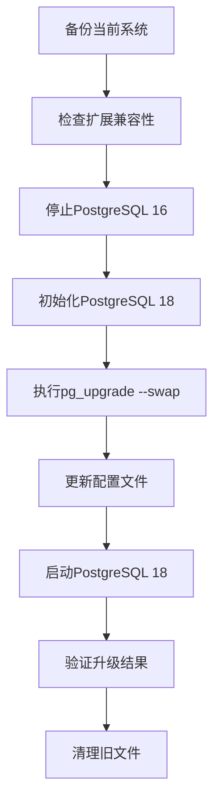

# PostgreSQL 16 → 18 升级指南

> **Linus Torvalds风格**: 简单、可靠、无废话的升级方案

## 概述

本升级包提供从PostgreSQL 16到18的完整升级解决方案，采用PostgreSQL 18的`--swap`模式实现最小停机时间的升级。

## 核心优势

- **最短停机时间**: 使用swap模式，避免数据复制
- **统计信息保留**: 升级后无需重新ANALYZE
- **并行处理**: 充分利用多核CPU加速升级
- **完整备份策略**: 多重备份保障数据安全
- **全面验证机制**: 确保升级成功和功能完整性

## 升级流程



## 脚本说明

### 1. `backup_pg16.sh` - 完整备份
```bash
# 功能：
- 完整逻辑备份 (pg_dumpall)
- 物理备份 (tar.gz)
- 配置文件备份
- 统计信息备份
- 自动清理旧备份

# 使用方法：
sudo ./backup_pg16.sh
```

### 2. `check_extensions.sh` - 兼容性检查
```bash
# 功能：
- 检查已安装扩展
- 验证更新路径
- 识别潜在问题
- 生成兼容性报告

# 使用方法：
sudo ./check_extensions.sh
```

### 3. `upgrade_to_pg18.sh` - 主升级脚本
```bash
# 功能：
- 前置条件检查
- pg_upgrade (swap模式)
- 配置文件更新
- 服务切换
- 错误处理和回滚

# 使用方法：
sudo ./upgrade_to_pg18.sh
```

### 4. `verify_upgrade.sh` - 升级验证
```bash
# 功能：
- 服务状态验证
- 数据完整性检查
- 性能基准测试
- 新特性验证
- 监控配置检查

# 使用方法：
sudo ./verify_upgrade.sh
```

### 5. `new_features_demo.sh` - 新特性演示
```bash
# 功能：
- DML RETURNING增强
- 新的统计和监控
- 字符串和排序功能
- pgcrypto增强
- 性能优化建议

# 使用方法：
sudo ./new_features_demo.sh
```

## PostgreSQL 18 关键新特性

### 1. DML RETURNING 语法增强
```sql
-- INSERT返回新旧值
INSERT INTO table (...) VALUES (...) RETURNING old.*, new.*;

-- UPDATE返回变化对比
UPDATE table SET col = val RETURNING old.col AS old_val, new.col AS new_val;

-- DELETE返回被删除数据
DELETE FROM table WHERE condition RETURNING old.*;
```

### 2. 增强的统计和监控
```sql
-- 新的I/O统计
SELECT * FROM pg_stat_io;

-- WAL统计增强
SELECT * FROM pg_stat_wal;

-- VACUUM/ANALYZE时间统计
SELECT total_vacuum_time, total_analyze_time FROM pg_stat_user_tables;
```

### 3. 性能优化功能
```sql
-- PG_UNICODE_FAST排序规则
CREATE TABLE t (col TEXT COLLATE "PG_UNICODE_FAST");

-- 新的配置选项
SET track_wal_io_timing = on;
SET track_cost_delay_timing = on;
SET file_copy_method = 'preferred';
```

### 4. 增强的安全性
```sql
-- SHA256/512密码哈希
SELECT crypt('password', gen_salt('sha256'));

-- FIPS模式检查
SELECT fips_mode();
```

## 配置调整建议

### postgresql.conf 关键配置
```ini
# PostgreSQL 18 推荐配置
track_wal_io_timing = on
track_cost_delay_timing = on
log_lock_failures = on
file_copy_method = 'preferred'

# 根据硬件调整
shared_buffers = 256MB          # 或内存的25%
work_mem = 4MB
maintenance_work_mem = 64MB
effective_cache_size = 1GB      # 或系统内存的75%
max_connections = 100
```

## 升级前检查清单

- [ ] 执行完整备份: `./backup_pg16.sh`
- [ ] 检查扩展兼容性: `./check_extensions.sh`
- [ ] 确认磁盘空间充足 (至少需要数据目录2倍空间)
- [ ] 确认无活跃连接或选择维护窗口
- [ ] 准备回滚计划

## 升级步骤

```bash
# 1. 备份
sudo ./backup_pg16.sh

# 2. 检查兼容性
sudo ./check_extensions.sh

# 3. 执行升级
sudo ./upgrade_to_pg18.sh

# 4. 验证升级
sudo ./verify_upgrade.sh

# 5. 查看新特性
sudo ./new_features_demo.sh
```

## 故障排除

### 常见问题及解决方案

1. **pg_upgrade失败**
   - 检查日志: `/var/log/postgresql/upgrade_*.log`
   - 验证路径配置
   - 确认权限设置

2. **服务启动失败**
   - 检查配置文件语法
   - 验证端口占用
   - 查看系统日志

3. **扩展不兼容**
   - 安装PostgreSQL 18兼容版本
   - 重新编译C语言扩展
   - 检查更新路径

4. **性能下降**
   - 检查统计信息是否保留
   - 运行ANALYZE
   - 调整配置参数

## 回滚计划

如果升级失败：

```bash
# 1. 停止所有PostgreSQL服务
sudo systemctl stop postgresql@18-main

# 2. 恢复备份
gunzip -c /var/backups/postgresql/full_backup_*.sql.gz | sudo -u postgres psql

# 3. 启动PostgreSQL 16
sudo systemctl start postgresql@16-main

# 4. 验证数据完整性
sudo -u postgres psql -c "SELECT count(*) FROM pg_database;"
```

## 性能监控

升级后监控关键指标：

```sql
-- 查看I/O统计
SELECT * FROM pg_stat_io;

-- 监控WAL活动
SELECT * FROM pg_stat_wal;

-- 检查查询性能
SELECT query, calls, total_time, mean_time
FROM pg_stat_statements
ORDER BY total_time DESC LIMIT 10;
```

## 最佳实践

1. **测试环境验证**: 在生产环境前先在测试环境验证
2. **监控观察**: 升级后密切监控系统性能
3. **逐步采用**: 逐步启用新特性，不要一次性全部启用
4. **文档更新**: 更新运维文档和监控配置
5. **团队培训**: 培训开发团队使用新特性

## 技术支持

- **日志位置**: `/var/log/postgresql/`
- **备份位置**: `/var/backups/postgresql/`
- **配置文件**: `/etc/postgresql/18/main/`
- **数据目录**: `/var/lib/postgresql/18/main/`

---

**注意**: 本脚本基于Debian/Ubuntu系统设计，其他Linux发行版可能需要调整路径配置。