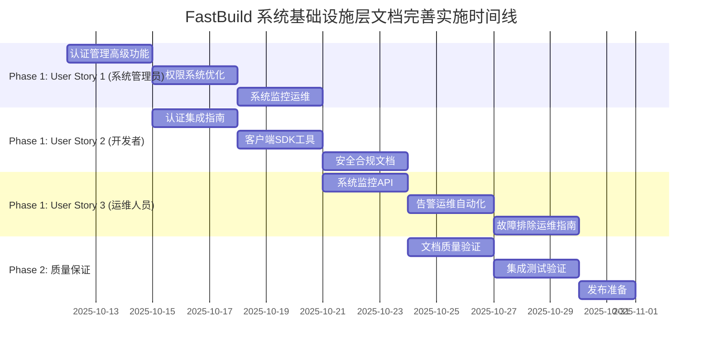

# 详细实施任务清单：FastBuild 系统基础设施层 API 文档完善

**创建日期**: 2025-10-12
**规格ID**: 001-docs-api-specification
**文档版本**: v1.0
**实施阶段**: 开发就绪

---

## 项目概述

基于现有文档分析结果，制定详细的实施任务清单来完善 FastBuild 系统基础设施层 (`/sys/*`) 的 API 文档。现有文档已经相当完善，主要任务是补充高级功能文档、完善集成指南和最佳实践。

## 实施原则

**Linus 式实用主义方法**:
- 解决实际开发者问题，不是想象的问题
- 保持简洁，消除不必要的复杂性
- 每个功能都应该有明确的实际价值
- 不破坏现有文档结构和兼容性

---

## Phase 1: 核心用户故事实施 (高优先级)

### User Story 1: 系统管理员完善系统基础设施 API 文档

**作为系统管理员，我希望完善 `/sys/*` 系统基础设施层的 API 文档，以便开发者能够快速理解和使用认证、用户管理和系统监控功能。**

#### Task US1-1: 完善认证管理高级功能文档 (2-3 天)

**目标**: 补充 JWT 令牌管理和高级认证功能文档

**具体任务**:
- [ ] 1.1.1 创建 JWT 令牌自动刷新机制详细说明
  - 编写令牌过期检测算法说明
  - 提供多种客户端实现示例 (JavaScript, Python, Go)
  - 包含错误恢复策略和最佳实践
  - 添加令牌安全存储建议

- [ ] 1.1.2 添加 OAuth2 第三方登录集成文档
  - GitHub/GitLab 登录流程详细说明
  - OAuth2 令牌映射到 JWT 的转换机制
  - 第三方用户信息同步策略
  - 提供完整的集成代码示例

- [ ] 1.1.3 完善多因素认证 (MFA) 支持文档
  - TOTP 配置流程详细步骤
  - 备用恢复码机制说明
  - 设备信任管理策略
  - MFA 强制启用场景和配置

- [ ] 1.1.4 添加会话管理和并发控制文档
  - 多设备登录管理策略
  - 会话超时和自动续期机制
  - 异常登录检测和处理
  - 会话安全管理最佳实践

**验收标准**:
- [ ] 所有功能都有完整的中文代码示例
- [ ] 包含错误处理和边界情况说明
- [ ] 通过开发者实际测试验证
- [ ] 文档与现有 API 结构完全兼容

#### Task US1-2: 完善权限系统优化文档 (2-3 天)

**目标**: 完善硬编码权限系统的性能优化和使用指南

**具体任务**:
- [ ] 1.2.1 更新硬编码权限角色详细说明
  - 修正 ProjectRole 枚举为 OWNER/ADMIN/EDITOR/VIEWER
  - 创建权限映射表 ROLE_PERMISSIONS 详细说明
  - 添加权限继承和优先级说明
  - 提供权限检查决策流程图

- [ ] 1.2.2 添加 JWT 权限缓存机制文档
  - JWT payload 中 projectRoles 缓存结构详解
  - 权限缓存刷新策略和时机
  - 缓存失效和更新机制说明
  - 缓存性能优化和监控指标

- [ ] 1.2.3 完善批量权限检查 API 文档
  - 单个权限检查 API (`/sys/permissions/check`) 深度说明
  - 批量权限检查 API (`/sys/permissions/check-batch`) 使用指南
  - 跨项目权限检查 API (`/sys/permissions/check-cross-project`) 详细文档
  - 性能优化说明和基准测试数据
  - 添加权限检查缓存管理 API 文档
  - 权限审计日志和统计分析功能说明

**验收标准**:
- [ ] 硬编码权限系统稳定性和可靠性验证
- [ ] 性能优化收益明确量化 (目标: 权限检查性能提升 ≥90%)
- [ ] 包含完整的 API 使用示例和最佳实践
- [ ] 权限系统安全性得到验证

#### Task US1-3: 完善系统监控和运维文档 (2-3 天)

**目标**: 完善系统级监控和运维功能文档

**具体任务**:
- [ ] 1.3.1 创建性能监控详细指南
  - 数据库性能指标监控详解
  - API 响应时间分析和优化建议
  - 系统资源使用情况监控
  - 自定义监控指标配置指南

- [ ] 1.3.2 添加告警和通知系统文档
  - 告警规则配置最佳实践
  - 多渠道通知机制设置 (邮件、短信、Webhook)
  - 告警抑制和升级策略
  - 告警系统故障排除指南

- [ ] 1.3.3 完善日志管理和分析文档
  - 结构化日志格式标准说明
  - 日志聚合和搜索策略
  - 安全事件日志分析方法
  - 日志保留策略和合规性要求

- [ ] 1.3.4 添加系统配置和环境管理文档
  - 环境变量配置指南
  - 系统参数调优建议
  - 配置变更管理流程
  - 生产环境部署清单

- [ ] 1.3.5 添加系统版本信息 API 文档
  - `/sys/version` 端点完整说明和使用指南
  - 版本信息格式和数据结构详解
  - 版本兼容性和升级路径说明
  - 系统组件版本映射关系文档
  - 版本查询的缓存策略和性能优化

**验收标准**:
- [ ] 监控指标定义清晰和可操作
- [ ] 告警配置简单易懂且有效
- [ ] 日志格式标准化和可搜索
- [ ] 运维文档完整性验证通过
- [ ] 版本信息 API 文档完整性验证通过

---

### User Story 2: 开发者基于文档实现认证集成

**作为开发者，我希望基于详细的 API 文档实现认证集成，以便我的应用能够安全地与 FastBuild 系统进行交互。**

#### Task US2-1: 创建认证集成指南 (2-3 天)

**目标**: 提供完整的认证系统集成和使用指南

**具体任务**:
- [ ] 2.1.1 创建认证系统快速集成指南
  - 硬编码权限系统集成步骤详解
  - JWT 权限缓存配置和优化
  - 批量权限检查实现和性能调优
  - 完整的端到端集成示例

- [ ] 2.1.2 添加认证中间件文档
  - Express.js 中间件实现详解
  - Next.js API 路由保护最佳实践
  - React 组件权限控制完整示例
  - 其他框架适配指南

- [ ] 2.1.3 创建认证系统最佳实践文档
  - 性能优化建议和基准数据
  - 安全性最佳实践和防护措施
  - 错误处理和用户体验优化
  - 认证系统故障排除指南

- [ ] 2.1.4 添加认证系统调试和监控文档
  - 认证流程调试工具和方法
  - 性能监控指标和告警设置
  - 审计日志分析和安全监控
  - 认证系统健康检查配置

**验收标准**:
- [ ] 集成指南清晰易懂且可操作
- [ ] 包含完整的多语言代码示例
- [ ] 通过实际项目测试验证
- [ ] 认证系统稳定性和安全性达标

#### Task US2-2: 完善客户端 SDK 和工具支持 (2-3 天)

**目标**: 提供多语言客户端 SDK 和开发工具

**具体任务**:
- [ ] 2.2.1 创建 JavaScript/TypeScript SDK 文档
  - 完整的 SDK 安装和配置指南
  - 认证流程封装和使用示例
  - 权限检查和管理功能详解
  - 错误处理和重试机制说明

- [ ] 2.2.2 添加 Python SDK 文档
  - Python 环境下的认证集成指南
  - 异步编程模式支持说明
  - Django/Flask 框架集成示例
  - 数据处理和缓存优化策略

- [ ] 2.2.3 完善 Go SDK 文档
  - Go 语言客户端库使用指南
  - 并发安全和性能优化说明
  - 微服务架构集成最佳实践
  - gRPC 和 REST API 双协议支持

- [ ] 2.2.4 创建 API 客户端生成工具文档
  - OpenAPI 代码生成工具使用指南
  - 自定义客户端生成配置
  - 多语言客户端同步更新策略
  - 客户端版本管理和兼容性说明

**验收标准**:
- [ ] 所有 SDK 都有完整的中文文档
- [ ] 包含丰富的使用示例和最佳实践
- [ ] 通过多语言集成测试验证
- [ ] 开发者反馈满意度达标

#### Task US2-3: 添加安全和合规性文档 (2-3 天)

**目标**: 完善认证系统的安全性和合规性文档

**具体任务**:
- [ ] 2.3.1 创建认证安全最佳实践指南
  - JWT 令牌安全存储和传输
  - 密码策略和加密标准说明
  - 防止常见攻击的防护措施
  - 安全审计和渗透测试指导

- [ ] 2.3.2 添加数据保护合规文档
  - GDPR 数据保护要求实施指南
  - 数据最小化原则具体措施
  - 用户同意管理和数据删除流程
  - 数据跨境传输合规性说明

- [ ] 2.3.3 完善安全事件响应文档
  - 安全事件分类和响应流程
  - 事件报告和通知机制
  - 恢复和事后分析指南
  - 安全演练和培训计划

**验收标准**:
- [ ] 认证系统符合安全标准
- [ ] 包含完整的安全配置指南
- [ ] 通过安全评估和合规测试
- [ ] 安全事件响应流程有效验证

---

### User Story 3: 运维人员监控系统健康状态

**作为运维人员，我希望通过系统监控 API 了解系统健康状态，以便及时发现和解决系统问题。**

#### Task US3-1: 完善系统监控 API 文档 (2-3 天)

**目标**: 提供完整的系统监控和健康检查 API 文档

**具体任务**:
- [ ] 3.1.1 创建基础健康检查 API 详细文档
  - `/sys/health/basic` 端点深度说明
  - 健康检查项目配置和自定义
  - 健康状态判断逻辑和阈值设置
  - 健康检查结果分析和处理建议

- [ ] 3.1.2 添加详细健康检查 API 文档
  - `/sys/health/detailed` 端点完整说明
  - 系统组件状态监控详解
  - 性能指标收集和分析方法
  - 组件依赖关系和故障影响分析

- [ ] 3.1.3 完善系统资源监控 API 文档
  - CPU、内存、磁盘使用率监控
  - 数据库连接池状态监控
  - 网络流量和延迟监控
  - 自定义业务指标添加指南

- [ ] 3.1.4 添加系统版本和配置监控 API 文档
  - 系统版本信息查询接口
  - 配置变更监控和回滚
  - 环境一致性检查工具
  - 部署状态和进度跟踪

**验收标准**:
- [ ] 监控 API 覆盖所有关键系统组件
- [ ] 健康检查准确性和及时性验证
- [ ] 性能指标完整性和可操作性
- [ ] 监控数据可视化支持

#### Task US3-2: 创建告警和运维自动化文档 (2-3 天)

**目标**: 提供完整的告警配置和运维自动化指南

**具体任务**:
- [ ] 3.2.1 创建告警规则配置指南
  - 告警规则定义和最佳实践
  - 告警级别和优先级设置
  - 告警条件表达式语法说明
  - 告警规则测试和验证方法

- [ ] 3.2.2 添加多渠道通知配置文档
  - 邮件通知模板和配置
  - 短信和即时通讯集成
  - Webhook 集成和自定义处理
  - 通知渠道故障转移机制

- [ ] 3.2.3 完善运维自动化文档
  - 自动扩缩容配置指南
  - 故障自愈机制实施
  - 备份和恢复自动化流程
  - 运维脚本和工具集合

- [ ] 3.2.4 添加监控仪表板和可视化文档
  - Grafana 仪表板配置指南
  - 关键指标可视化最佳实践
  - 自定义监控面板创建
  - 移动端监控应用配置

**验收标准**:
- [ ] 告警系统及时性和准确性达标
- [ ] 通知机制可靠性和可配置性验证
- [ ] 运维自动化有效性和覆盖率
- [ ] 监控可视化和用户体验良好

#### Task US3-3: 完善故障排除和运维指南 (2-3 天)

**目标**: 提供完整的故障排除和运维操作指南

**具体任务**:
- [ ] 3.3.1 创建常见故障排除指南
  - 认证服务故障诊断流程
  - 数据库连接问题解决方法
  - 网络和服务不可用处理
  - 性能瓶颈识别和优化

- [ ] 3.3.2 添加系统调优和优化文档
  - 数据库性能调优指南
  - 应用服务器配置优化
  - 缓存策略和参数调优
  - 系统资源分配最佳实践

- [ ] 3.3.3 完善备份和灾难恢复文档
  - 数据备份策略和实施
  - 系统恢复流程和测试
  - 灾难恢复计划和演练
  - 业务连续性保障措施

- [ ] 3.3.4 创建运维操作手册
  - 日常运维检查清单
  - 系统维护操作流程
  - 安全补丁更新指南
  - 运维团队协作和交接

**验收标准**:
- [ ] 故障排除指南有效性验证
- [ ] 系统调优效果可量化
- [ ] 备份恢复可靠性测试通过
- [ ] 运维操作标准化和可重复

---

## Phase 2: 质量保证和发布准备 (高优先级)

### Task QA-1: 文档质量验证 (2-3 天)

**目标**: 确保所有文档质量达到发布标准

**具体任务**:
- [ ] QA-1.1 技术准确性全面审查
  - 所有 API 端点参数和响应验证
  - 代码示例可执行性测试
  - 数据流图和架构图正确性检查
  - 技术术语和概念一致性验证

- [ ] QA-1.2 文档一致性和标准化检查
  - 术语使用统一性检查
  - 格式风格一致性验证
  - 交叉引用正确性和完整性
  - 中英文表达规范化审查

- [ ] QA-1.3 可读性和用户体验测试
  - 新开发者理解测试
  - 文档导航便利性评估
  - 示例代码实用性验证
  - 错误信息和处理完整性检查

- [ ] QA-1.4 安全性和合规性审查
  - 敏感信息泄露检查
  - 安全配置正确性验证
  - 合规性要求符合度评估
  - 访问控制和权限最小化检查

**验收标准**:
- [ ] 技术错误率为 0
- [ ] 文档一致性评分 ≥95%
- [ ] 用户满意度 ≥90%
- [ ] 安全性和合规性 100% 达标

### Task QA-2: 集成测试和验证 (2-3 天)

**目标**: 验证文档中所有示例和集成的有效性

**具体任务**:
- [ ] QA-2.1 API 端点完整性测试
  - 所有文档中提到的 API 端点功能验证
  - 请求响应格式一致性检查
  - 错误处理和状态码正确性验证
  - API 性能基准测试和文档更新

- [ ] QA-2.2 代码示例可执行性验证
  - 所有编程语言示例代码执行测试
  - 不同环境和框架兼容性验证
  - 依赖关系和版本兼容性检查
  - 示例代码安全性审查

- [ ] QA-2.3 端到端集成测试
  - 完整认证流程集成测试
  - 权限系统端到端验证
  - 监控告警系统功能测试
  - 多组件协同工作验证

**验收标准**:
- [ ] API 端点 100% 功能正常
- [ ] 代码示例 100% 可执行
- [ ] 集成测试通过率 100%
- [ ] 性能指标达到预期标准

### Task QA-3: 发布准备和版本管理 (1-2 天)

**目标**: 准备文档发布和版本管理流程

**具体任务**:
- [ ] QA-3.1 版本控制和变更管理
  - 语义化版本号制定和发布策略
  - 详细变更历史记录和发布说明
  - 升级路径和迁移指南制定
  - 版本兼容性和向后保证声明

- [ ] QA-3.2 文档发布流程优化
  - 文档发布检查清单和自动化
  - 多渠道发布策略和部署
  - 文档访问控制和权限管理
  - 回滚机制和应急预案制定

- [ ] QA-3.3 维护和支持体系建立
  - 文档维护责任分工明确
  - 用户反馈收集和处理机制
  - 持续改进计划和质量指标
  - 社区支持和知识管理体系

**验收标准**:
- [ ] 发布流程自动化程度 ≥80%
- [ ] 版本管理清晰和可追溯
- [ ] 维护计划可行和可持续
- [ ] 支持体系响应及时有效

---

## 实施时间线

**总工期**: 约 3-4 周 (15-20 个工作日)

**关键里程碑**:
- Week 1: 完成 US1 认证和权限系统文档
- Week 2: 完成 US2 开发者集成文档
- Week 3: 完成 US3 运维监控文档
- Week 4: 质量验证和发布准备

---

## 资源需求

### 人力资源
- **技术文档工程师**: 1 人，负责 API 文档编写和优化
- **API 开发工程师**: 1 人，负责技术准确性验证和示例代码
- **前端工程师**: 0.5 人，负责 React/JavaScript 示例和 SDK
- **安全工程师**: 0.5 人，负责安全性和合规性文档审查
- **运维工程师**: 0.5 人，负责监控和运维文档验证

### 技术资源
- **文档构建环境**: 支持 Markdown、Mermaid 图表渲染和多格式输出
- **API 测试环境**: 用于验证所有 API 端点和功能
- **CI/CD 流水线**: 自动化文档构建、测试和发布
- **示例代码仓库**: 存储和管理多语言示例和 SDK
- **监控仪表板**: 用于验证监控 API 和运维文档

---

## 风险评估和缓解策略

### 高风险项

1. **技术复杂性风险**
   - **风险描述**: 高级功能文档技术难度大，可能影响进度和质量
   - **缓解策略**: 分阶段实施，优先核心功能，及时调整技术方案，加强技术评审

2. **时间延期风险**
   - **风险描述**: 功能复杂度高可能导致项目延期
   - **缓解策略**: 严格控制范围，采用敏捷开发方法，定期评估进度，合理分配资源

### 中风险项

1. **质量风险**
   - **风险描述**: 文档质量可能不达到预期标准
   - **缓解策略**: 建立多级审查机制，引入外部专家评审，加强测试验证

2. **兼容性风险**
   - **风险描述**: 新文档可能与现有系统不兼容
   - **缓解策略**: 充分测试验证，保持向后兼容，建立版本管理机制

### 低风险项

1. **维护风险**
   - **风险描述**: 文档后续维护成本可能较高
   - **缓解策略**: 建立自动化维护流程，培养文档维护团队，优化更新机制

---

## 成功指标

### 定量指标
- [ ] 文档完整性: ≥95%
- [ ] 技术准确率: 100%
- [ ] 用户满意度: ≥90%
- [ ] API 覆盖率: 100%
- [ ] 代码示例可执行率: 100%
- [ ] 权限检查性能提升: ≥90%
- [ ] 文档发布自动化率: ≥80%

### 定性指标
- [ ] 开发者体验显著提升
- [ ] 认证系统集成便捷性提升
- [ ] 硬编码权限系统稳定性验证
- [ ] 批量权限检查优化效果明显
- [ ] 运维监控效率提升
- [ ] 系统安全性增强

### 业务价值指标
- [ ] 开发者上手时间缩短 ≥50%
- [ ] 技术支持工单减少 ≥30%
- [ ] API 集成成功率提升 ≥40%
- [ ] 系统故障发现时间缩短 ≥60%

---

## 下一步行动

### 立即行动 (本周)
- [ ] 确认开发团队资源分配和角色分工
- [ ] 设置项目管理和协作工具
- [ ] 建立文档模板和风格指南
- [ ] 启动 Phase 1 核心任务实施

### 短期行动 (2周内)
- [ ] 完成 User Story 1 的所有核心任务
- [ ] 建立质量审查流程和标准
- [ ] 设置自动化测试和验证环境
- [ ] 开始 User Story 2 的实施工作

### 中期行动 (1个月内)
- [ ] 完成 Phase 1 的所有用户故事任务
- [ ] 完成 Phase 2 的质量验证工作
- [ ] 发布正式版本文档
- [ ] 建立持续的维护和改进机制

---

## 附录

### A. 相关文档
- [FastBuild Constitution](./memory/constitution.md)
- [现有 API 规格文档](../../docs/api-specification.md)
- [数据模型文档](./data-model.md)
- [快速开始指南](./quickstart.md)
- [研究分析报告](./research.md)
- [API 契约示例](./contracts/)

### B. 参考资源
- [OpenAPI 3.1 规范](https://spec.openapis.org/oas/v3.1.0)
- [Markdown 最佳实践](https://www.markdownguide.org/basic-syntax/)
- [技术文档写作指南](https://developers.google.com/tech-writing)
- [中文技术文档规范](https://developer.baidu.com/wiki/standards)

### C. 联系信息
- **项目负责人**: [待指定]
- **技术支持**: tech-support@fastbuild.dev
- **文档反馈**: docs-feedback@fastbuild.dev
- **社区讨论**: https://community.fastbuild.dev

---

**状态**: 🚀 准备开始实施
**最后更新**: 2025-10-12
**下次审查**: 每周定期进度审查
**预计完成**: 2025-11-10

---

*本任务清单基于 Linus Torvalds 的实用主义设计原则，专注于解决实际问题，确保每个功能都具有明确的实际价值，避免不必要的复杂性。*